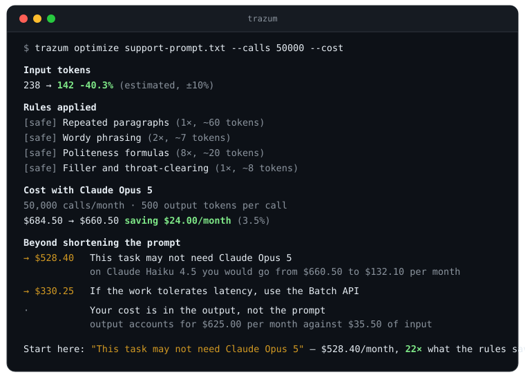
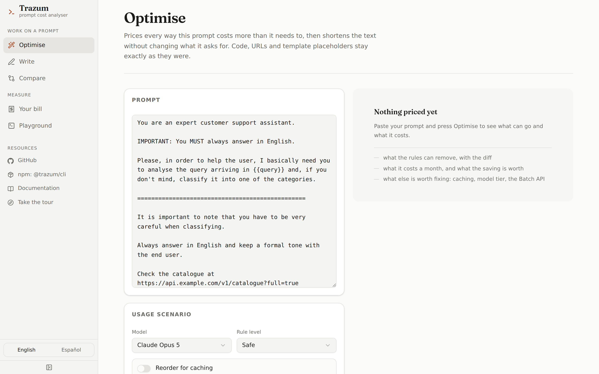

<div align="center">

# Trazum

### Most of your LLM bill is not the prompt. Trazum finds where it is.

**A deterministic cost analyser for prompts** — offline, free, same answer every
time. It reports fourteen findings priced in dollars per month: caching you are
not getting, a model tier you may not need, a schema you pay to describe on
every call. Shortening the prompt is one of them, and it is rarely the biggest.

[](https://github.com/Davmunrey/Trazum/actions/workflows/ci.yml)
[](https://github.com/Davmunrey/Trazum/actions/workflows/security.yml)
[](LICENSE)
[](package.json)
[](#layout)



*Real output, transcribed. Read the last two lines: the rules recovered $24.00
a month, and the advisory above them is worth $528.40 — **22× more**. That gap
is the entire argument for this tool.*

</div>

**The prompt is the part everyone looks at, and usually the cheap part.** In the
run above, forty percent of the text came out and it moved 3.5% of the bill.
What moved the rest was a question nobody was asking: does this task need the
model it is running on?

**Every figure has a receipt.** Fourteen advisories, each priced per month and
reproducible on a single file — caching you are not getting, work that could go
through the Batch API, a schema costing tokens on every call to describe a shape
the request could carry as a parameter. Underneath them, twelve deterministic
rules that shorten the text itself: same input, same output, free, offline, and
never touching code, URLs or placeholders. On top, an **optional LLM pass** for
the compression rules cannot do, through whichever provider you configure, which
never runs unless you ask.

```
                      ┌──────────────┐
                      │ @trazum/core │   the library: rules, tokens, pricing
                      └──────┬───────┘   zero dependencies, browser-safe
         ┌─────────────┬─────┴────────┬──────────────┐
   @trazum/cli    @trazum/mcp    @trazum/web       action/
 34 commands       MCP server      Next.js     comments on pull requests
                 for your agents
```

## The thirty-four commands

| Command | What it answers |
|---|---|
| [`trazum init`](#the-first-five-minutes-trazum-init) | What is in this repository, and what is the one thing worth fixing? *The first command to run.* |
| [`trazum optimize`](#cli) | What can come out of this prompt, and what is that worth a month? |
| [`trazum check`](#cli) | Does this prompt fit its token budget, and has the repository drifted past its recorded baseline? *Exits 1 when either fails — this is the CI gate.* |
| [`trazum baseline`](#the-ci-gate-a-budget-is-a-ceiling-a-baseline-is-a-gate) | What does this repository's prompts cost right now? *Records it, to commit.* |
| [`trazum diff`](#did-this-edit-make-it-worse) | What did this edit cost? |
| [`trazum rank`](#which-prompt-to-fix-first-trazum-rank) | Of these forty prompts, which is worth an afternoon? |
| [`trazum doctor`](#the-whole-workspace-at-once-trazum-doctor) | What is wrong across the whole workspace? |
| [`trazum prune`](#which-few-shot-examples-earn-their-tokens-trazum-prune) | Which few-shot examples earn their tokens? Measured, and it asks before spending. |
| [`trazum blame`](#who-made-this-prompt-expensive-trazum-blame) | Who made this prompt expensive, and when? |
| [`trazum eval`](#does-the-shorter-prompt-still-work) | Does the shorter prompt still do the job? |
| [`trazum where`](#prompts-where-they-actually-live) | Which prompts are hiding inside my source files? |
| [`trazum models`](#every-model-you-pay-for-by-the-token) | What does each model cost, and what is its cache minimum? |
| [`trazum profile`](#where-the-money-actually-went-trazum-profile) | Where did the money actually go? *Reads a usage log, not a prompt.* |
| [`trazum route`](#is-the-cheaper-model-good-enough-trazum-route) | Is the cheaper model good enough? *Measured, and it asks before spending.* |
| [`trazum plan`](#the-plan-trazum-plan) | Of everything the log shows, what do I do first, and what is each move worth? |
| [`trazum verify`](#did-it-work-trazum-verify) | Did the plan's savings actually arrive? *Three outcomes, never two.* |
| [`trazum history`](#the-long-run-trazum-history) | What have twenty reports been saying that no two of them could? *Shapes, never forecasts.* |
| [`trazum connect`](#your-bill-without-the-export-trazum-connect) | What did the provider actually bill me? *Read from their API, nothing exported by hand.* |
| [`trazum store`](#keeping-it-trazum-store) | What have I measured and kept? *Aggregates only — no prompt text, ever.* |
| [`trazum watch`](#the-afternoon-it-happened-trazum-watch) | Has anything crossed a budget? *Measured crossings only — never a forecast.* |
| [`trazum serve`](#before-the-call-is-sent-trazum-serve) | What will this call cost, and is there budget? *Answered in milliseconds, halves kept apart.* |
| [`trazum gateway`](#in-the-path-of-the-call-trazum-gateway) | Can it stop the call instead of advising against it? *Refuses; never substitutes.* |
| [`trazum ladder`](#is-the-ladder-saving-money-or-is-it-a-bill-trazum-ladder) | Is cheap-first-escalate-on-failure saving money, or costing it? *Break-even rate, stated.* |
| [`trazum experiment`](#two-arms-on-real-traffic-trazum-experiment) | Which of two arms is better on real traffic? *A winner only when there is one.* |
| [`trazum quality`](#the-gate-that-fails-a-build-for-quality-trazum-quality) | Did that prompt change quietly make the product worse? *Refuses to blame what it cannot attribute.* |
| [`trazum semantic`](#the-findings-a-dictionary-cannot-see-trazum-semantic) | Does this prompt say the same thing twice, or contradict itself? *The model proposes; the checker disposes.* |
| [`trazum owners`](#whose-money-trazum-owners) | Whose budget does this land on? *The unallocated is never spread.* |
| [`trazum commitment`](#should-you-sign-that-commitment-trazum-commitment) | What would that committed-use deal have been worth? *On measured months, both directions priced.* |
| [`trazum report`](#the-year-from-what-was-already-written-down-trazum-report) | What did the year actually look like? *No new data, and it lists its own blind spots.* |
| [`trazum conform`](#building-on-the-format-trazum-conform) | Does the document my tool emits conform, and what will it not be able to answer? |
| [`trazum rollup`](#more-than-one-machine-trazum-rollup) | Four of us measured four things — what is the total, and what did merging lose? *A format and a merge, not a service.* |
| [`trazum pulse`](#did-anything-stop-running-trazum-pulse) | Did the things that are supposed to run, run? *Runs nothing itself — your CI is the thing that notices.* |
| [`trazum rules`](#what-it-actually-does) | Which rules exist, and what does each one do? |
| [`trazum feedback`](#telling-us-something-trazum-feedback) | Where do I report this, and what will you ask me for? *Sends nothing.* |

## Contents

- [What it actually does](#what-it-actually-does) — the five things, and what it refuses to touch
- [Getting started](#getting-started) — CLI, web, the GitHub Action, pre-commit
- [The first five minutes](#the-first-five-minutes-trazum-init) — `init`, and the four things it refuses to write
- [Building on the format](#building-on-the-format-trazum-conform) — the contracts, the guarantees, and the doctrine
- [More than one machine](#more-than-one-machine-trazum-rollup) — several people's documents, one bill, every gap preserved
- [Did anything stop running](#did-anything-stop-running-trazum-pulse) — the outside view of a scheduled job
- [Which few-shot examples earn their tokens](#which-few-shot-examples-earn-their-tokens-trazum-prune) — measured, and it asks before spending
- [An MCP server for your agents](#an-mcp-server-so-an-agent-can-budget-its-own-prompts) — budget a prompt before sending it
- [Languages](#languages) — what the dictionaries cover, and what they deliberately do not
- [Connecting your own LLM](#connecting-your-own-llm) — one wire format, four native providers, and the SSRF rules
- [Every model you pay for by the token](#every-model-you-pay-for-by-the-token) — pricing across seven providers, live via OpenRouter
- [Token counting](#token-counting) — the estimator, and the error band it prints
- [Limitations, stated plainly](#limitations-stated-plainly) — read this one
- [Running it on a schedule](docs/running.md) — cron, systemd, Actions, and where the answer runs out
- [Everything else](docs/README.md) — the documentation index, arranged by whether you are
  choosing this, using it, extending it or maintaining it
- [Layout](#layout) · [Updating prices](#updating-prices) · [Privacy](#analytics-and-privacy) · [Roadmap](#roadmap-and-contributing)

---

## What it actually does

**1. Tells you where the money actually is.** This is the part worth reading
first, because it is where the numbers are. Every advisory is priced per month
against your own call volume, and none of them is about making the text shorter:

| Advisory | Why it matters |
|---|---|
| Prompt caching | Reading from cache costs 10% of input. The saving is computed over the **real stable prefix**: in a template with `{{placeholders}}`, only what precedes the first one is cached — not the whole prompt. |
| Reorder the template | Stable instructions sitting *after* the first variable placeholder never cache today. Trazum prices moving them in front — and with `--reorder`, [does it](#reordering-for-the-cache---reorder). |
| Batch API | 50% off input and output when the work tolerates latency. |
| Cheaper model | Complexity heuristic: if the task looks simple, what dropping a tier would save. |
| Output-dominated cost | If you pay more for the answer than for the prompt, shortening the prompt has a ceiling. |
| Promotional pricing | Warns when you are budgeting with an introductory price that expires. |
| Context window | If the prompt does not fit, the call is going to fail. |
| Contradictory instructions | "Answer in English" three paragraphs above "reply in the customer's own language". The model has to pick one, and which one can change between calls — a correctness problem that also costs tokens twice. |
| Redundant examples | Few-shot examples that are near-copies of an earlier one, and what they cost per month. |
| Output format stated twice | A schema shown in a code block and then walked again in prose. The block is the version worth keeping. |
| Schema the request could carry | A schema block introduced by "Output format:" is paid for in input tokens on every call. Every major API now takes a response schema as a *parameter* — and moving it there is both cheaper and stricter. See below. |

The last four are **advisory only**. A contradiction has a right answer that only
the author knows, and an example that looks redundant may be demonstrating a
boundary case on purpose. Trazum points; it does not cut.

#### The one finding that is not a trade-off

Most of what Trazum reports is a choice: shorter against clearer, cheaper against
more capable. Moving an output schema out of the prompt is neither.

```
→ The output schema could travel in the request instead of the prompt
  A schema block introduced by "output format" defines `category`, `reply`,
  `escalate_to_human`, `confidence`, costing about 62 tokens on every call.
```

Those tokens are paid on **every call** to have the model read a shape and be
asked, politely, to match it. `output_config.format`, `response_format`,
`responseSchema` — whatever your provider calls it — takes the same shape as a
request parameter, where the decoder is constrained rather than persuaded. Cheaper
*and* stricter.

**Trazum reports it and never does it**, because it is not a change to the prompt:
it is a change to the code that sends the prompt. A rule that deleted the schema
would leave a prompt asking for a shape it no longer describes, sent by a client
nobody updated — strictly worse than what it started from.

**The one way this could do harm, and what stops it.** `Output format: {...}` is
a contract and moving it is free; `Input: {...}` inside a few-shot example is
*data the prompt needs*, and moving it breaks the prompt. So nothing is guessed:
a block counts only when a phrase from the output-cue dictionary appears
immediately before it, in one of the seven languages the rules cover. No phrase,
no finding — a false negative, which is the right direction to be wrong in.

The example detector finds near-copies — the way few-shot blocks actually grow.
It deliberately does not flag *paraphrases*: that case needs a model, and is on
the roadmap for the LLM pass.

**2. Then it trims the prompt itself.** Twelve deterministic rules: courtesy,
filler, verbose phrasing, duplicated paragraphs, decorative separators, shouting
in capitals. Two levels — `safe` (no semantic risk) and `aggressive` (read the
diff). This is the smallest number on the page more often than not, and it is
reported that way rather than dressed up.

**3. And never touches what would break the prompt.** Code fences, inline code,
URLs, template placeholders (`{{x}}`, `${x}`, `{x}`, ``) and XML/HTML tags
are isolated before any rule runs. If a rule ever did make one of those
disappear, that rule is discarded and the rest carry on.

**Reviewing an aggressive run.** Every rule reports what it actually changed,
so the level that saves the most is judged rule by rule rather than as one wall
of diff — and a single rule you disagree with comes off with `--disable`:

```
  [aggressive] Intensifiers (3×, ~6 tokens)
      VERY → —
      extremely → —
      quite → —
  [aggressive] Self-verification instructions (1×, ~17 tokens)
      You should double-check your answer before re… → —
```

**4. Optionally, runs it past an LLM.** The result is only accepted if it is
shorter and leaves protected content byte-identical. Otherwise the deterministic
version stands. It never returns something worse than where it started. With
`--suggest` it proposes phrases one at a time — `You should always make sure to →
Always` — each checked against your prompt before you see it, so eight surviving
out of ten is a useful morning rather than a rewrite to read end to end.

**5. Answers the questions that come before "shorten this".** Trimming one file
is the smallest thing here. `optimize` is one of thirty-four commands — [the table
above](#the-thirty-four-commands) names what each answers — because knowing a prompt
is wasteful is not the same as knowing *which* prompt, *whose* change made it so,
or whether the shorter version still works.

`check`, `diff`, `rank` and `blame` all take `--markdown-out`, so the answer can
land in a pull request comment rather than a terminal nobody is looking at.

**It gates in whatever CI you already run.** One binary, two exit codes, and
[worked recipes for GitLab CI, Jenkins, CircleCI and a pre-commit hook](docs/ci.md)
— no vendor plugin, because each one would be a second code path that drifts
from the exit codes it is supposed to relay.

---

## Getting started

```bash
npx @trazum/cli init
```

No install, no key, no network. It reads what is already here — your prompts,
which provider your code calls, a usage log if one is lying around — writes a
config out of what it can actually justify, and prints the single most valuable
thing it found. See [the first five minutes](#the-first-five-minutes-trazum-init).

Or start from one file:

```bash
npx @trazum/cli optimize your-prompt.txt --cost
```

Either way, keep it around:

```bash
npm install -g @trazum/cli     # the terminal
npm install @trazum/core       # the library
npm install @trazum/mcp        # the MCP server, for an agent
```

<details>
<summary>From source, if you are working on Trazum itself</summary>

```bash
npm install
npm run build      # core + cli
npm test           # every suite: core, CLI, web, Action
npm run verify     # the above plus typecheck and the web build
```

</details>

<sub>The test count used to be written here as a number. It said 580 while the real
figure had reached 798, because nothing checked it — so it now says what the command
covers instead. A number nobody maintains is worse than no number.</sub>

### The first five minutes: `trazum init`

```bash
npx @trazum/cli init
```

```
What is here

  Running inside a terminal.
  1 prompt file found.
  Usage log found: usage.jsonl.

What the config would say
  + usage.model  100% of the measured bill went to claude-opus-5
  + usage.callsPerMonth  240 calls over 30 days, stated as 240 a month
  + usage.avgOutputTokens  96000 output tokens over 240 calls averages 400
  · usage.cacheHitRate  this log has no cache columns at all, which is not the same as a hit rate of zero
  · usage.batchEligible  whether the work can wait for a batch window is a product decision, and no log records it
  · labels  1 label in the log, and nothing here proves which prompt file sends which
  · spend.maxUsd  a budget is a policy, so it is yours to set — the measured figure is $38.40 over 30 days

The most valuable thing found
  240 calls labelled "classify" went to Claude Opus 5 over 30 days.
  They cost $38.40.
  The same work fits Claude Sonnet 5, which is cheaper per token.
  The Batch API halves both halves of the bill, for work that can wait.
  Together: $30.72 over the same 30 days.
```

It is a **detection, not a wizard**. Nothing is asked. Each line above is
something that was found — a prompt, a provider named in your code, a log —
or a key it declined **with what would settle it**. `--dry-run` prints the
config and writes nothing; `--yes` replaces one that is already there;
without it an existing config is left alone.

**Every key it writes carries the arithmetic that justified it.** A generated
config full of guessed thresholds is one nobody trusts and everybody deletes,
and it is worse than an empty one, because six weeks later it reads as a
decision somebody made.

Four things it refuses to write, and they are the interesting four:

- **A budget.** A log says what your traffic *was*; a budget says what it *may
  cost*, which no log can answer. "The measured month plus twenty per cent"
  would be this tool inventing a threshold and then grading you against it. So
  the measured figure is handed over and the limit stays yours.
- **A monthly rate from a short window.** Twenty-eight days minimum, so every
  weekday appears the same number of times. Four days multiplied by seven is a
  forecast wearing a measurement's clothes.
- **A cache hit rate from a log with no cache columns.** Not recorded is not
  not-happened. Writing `0` there would tell every later caching advisory that
  caching is doing nothing — a finding invented out of a missing field.
- **`batchEligible`, in either direction.** Whether the work tolerates a batch
  window is a product decision, and no log records it. `false` would quietly
  delete the batch lever from every report; `true` would sell a saving on
  latency nobody agreed to give up.

It also declines a model when your code names a *provider* and no model. `where`
prints a provider's default because a reader can see it is a guess; a config
file cannot.

No usage anywhere? It says so, and points at
[docs/usage-logs.md](docs/usage-logs.md) — Anthropic, OpenAI, the Vercel AI SDK
and an OTel collector, with records you can copy.

`trazum init --json` is the same proposal as data, including every declined key
and its reason — [contracted in docs/json-output.md](docs/json-output.md#the-first-run-document).
It writes nothing.

### CLI

```bash
node packages/cli/dist/index.js optimize prompt.txt --calls 50000 --diff
```

```
Input tokens
  190 → 137   -27.9% (estimated, ±10%)

Rules applied
  [safe] Repeated paragraphs (1×, ~19 tokens)
  [safe] Wordy phrasing (1×, ~3 tokens)
  [safe] Politeness formulas (4×, ~19 tokens)
  [safe] Filler and throat-clearing (2×, ~11 tokens)

Cost with Claude Opus 5
  50,000 calls/month · 300 output tokens per call
  $422.50 → $409.25   saving $13.25/month (3.1%)

Beyond shortening the prompt
  → This task may not need Claude Opus 5 ~$327.40/month
  → If the work tolerates latency, use the Batch API ~$204.62/month
```

The other thirty-three commands, each with its own section below:

```bash
trazum doctor                        # survey the whole workspace
trazum plan usage.jsonl              # the findings as a ranked plan
trazum verify plan.json --against new.jsonl   # did it work?
trazum history reports/              # the long run, from stored reports
trazum connect anthropic             # your bill, read from the provider
trazum store                         # what is kept, and what a prune takes
trazum watch --once                  # did anything cross, this afternoon
trazum serve                         # answer before the call is sent
trazum rollup a.json b.json          # several people's bills, one roll-up
trazum pulse --max-stale-hours 36    # did anything stop running?
trazum rank prompts/                 # which one to fix first
trazum blame prompts/system.txt      # who made it expensive, and when
trazum diff old.txt new.txt          # what this edit cost
trazum check prompts/ --max-tokens 2000
trazum eval prompts/system.txt --cases cases.json
trazum where src/agent.ts            # which provider this actually calls
trazum models                        # pricing table and cache minimums
trazum rules                         # what each rule does, and its id
trazum --help
```

When redirected it writes only the optimised prompt, so it pipes cleanly:

```bash
cat prompt.md | node packages/cli/dist/index.js optimize - > prompt.optimised.md
```

To install it as a `trazum` command:

```bash
npm link -w @trazum/cli
```

**Token budgets in CI.** `trazum check` exits 1 when the prompt busts its
budget, so a template that grows unchecked breaks the build instead of the bill:

```bash
trazum check prompts/system.txt --max-tokens 2000
# FAILED 2,481 tokens busts the budget of 2,000.
#   Optimised with "trazum optimize --level safe" it would land at ~1,913 tokens and fit.
```

**Before it reaches CI: a pre-commit hook.**

```bash
ln -s ../../scripts/pre-commit .git/hooks/pre-commit
```

```
trazum: these prompts are over their token budget:
  prompts/system.txt

  trazum doctor .          shows how far over, and what it costs
  Shorten them, raise the budget in trazum.config.json, or commit with --no-verify.
```

**It blocks only on prompts your commit actually touches.** A hook that refuses a
commit over a *different* prompt somebody else committed last month is one people
learn to pass `--no-verify` to — and then it is worse than no hook at all.
`TRAZUM_HOOK=0` disables it; nothing staged, no Trazum installed, no prompts or an
unreadable config each say so once and exit 0. One real limitation: it reads the
working tree, not the staged blobs, so it judges a prompt's newest edit even when
an older version is what is staged.

In GitHub Actions, use the packaged action — nothing to install:

```yaml
- uses: actions/checkout@v7
- uses: Davmunrey/Trazum@06c40d431630d6688501452a59e1da95f58b975c  # 1.56.1
  with:
    target: prompts/system.txt
    max-tokens: 2000
```

**One-click fixes, as suggestions.** `suggest-fixes: true` posts the optimised
prompt as a GitHub *suggested change*, which a reviewer applies with one button:

```yaml
permissions:
  contents: read
  pull-requests: write
with:
  target: prompts/
  suggest-fixes: true
  github-token: ${{ secrets.GITHUB_TOKEN }}
```

**A suggestion, not a commit, and that is deliberate.** Committing the fix would
need `contents: write`; a suggestion lands in the same place with the same one
click on the `pull-requests: write` the comment mode already uses, and you stay
the one who commits. Two limits, both real: it uses the **safe** level only — a
one-click apply is not the moment for a diff that wants reading — and a
suggestion can only anchor to lines in the pull request's diff, so a PR that
edits three lines of a forty-line prompt gets a notice explaining why there is
no suggestion rather than a partial rewrite.

**Pinned to a commit SHA, not a tag** — the same rule
[SECURITY.md](SECURITY.md) states and `security.test.js` enforces on every
third-party action in this repository. A tag is a mutable pointer: whoever can
move `v1` can change what runs in your workflow with your token. The `# 1.0.0`
comment names the version at that commit, and is what Dependabot reads to offer
you the bump.

**The report lands in the run summary automatically** — every run, pass or fail,
with no token and no permissions. To also post it as a pull request comment that
replaces its own previous one:

```yaml
permissions:
  contents: read
  pull-requests: write     # the action cannot grant itself this

steps:
  - uses: actions/checkout@v7
  - uses: Davmunrey/Trazum@06c40d431630d6688501452a59e1da95f58b975c  # 1.56.1
    with:
      target: prompts/            # a directory uses trazum.config.json budgets
      comment: true
      github-token: ${{ secrets.GITHUB_TOKEN }}
```

**Commenting can never fail your build.** No pull request, comments disabled, or
a read-only token — each prints a notice and carries on, because the report has
already reached the run summary. That matters on **pull requests from forks**,
where `GITHUB_TOKEN` is read-only by design and the comment simply will not post.

If you go looking for a way around that, the answer you will find is
`pull_request_target`. **Don't.** It runs with a writable token against the base
repository while checking out code the contributor controls, which turns "we
wanted to comment on a PR" into arbitrary code execution with your secrets. The
run summary is there precisely so you do not need it. Trazum asserts in CI that
it uses `pull_request_target` nowhere.

A passing report is collapsed; a failing one is not. A green table that stays
green on every push is the thing you learn to skip — and then you skip the red
one too.

**The spend gate, packaged.** The same action gates the bill itself when handed
a usage log instead of prompts — mutually exclusive with `target`, because one
run gates tokens before the money is spent or the spend itself, and saying
which is the caller's job:

```yaml
- uses: Davmunrey/Trazum@06c40d431630d6688501452a59e1da95f58b975c  # 1.56.1
  with:
    usage-log: logs/yesterday.jsonl
    max-usd: '50'            # exit 1 over budget — no period assumed
    # against: logs/day-before.jsonl
    # max-growth-usd: '10'
    # label: chat            # one workload's budget
    # since: '2026-08-11'    # one period's — until includes its whole day
    # until: '2026-08-17'
```

The profile report lands in the run summary either way, and a failing gate
still writes it — a red build with no report is a mystery, and mysteries get
deleted from pipelines.

**The report leaves the terminal in three shapes.** `--markdown-out` for a CI
summary or a PR comment, `--csv-out` for whoever signs off the bill (one row
per workload and model, no total row, empty cells where dollars are unknown),
and `--json` for anything built on top — documented field by field in
[docs/json-output.md](docs/json-output.md), with a `schemaVersion` and a test
that fails if the two ever disagree. Point `profile` at a **directory** and a
month of rotated logs is read in name order as one bill.

Or by hand, if you already have the repo checked out:

```yaml
- run: npm ci && npm run build
- run: node packages/cli/dist/index.js check prompts/system.txt --max-tokens 2000
```

### The multiplication stops guessing: `--from-log`

Every saving `optimize` prints is `token delta × usage` — and until now the
usage half (`--calls`, `--output-tokens`, `--cache-hit-rate`) was typed by a
human who was guessing. A usage log knows all three exactly, plus the model
the calls actually went to:

```bash
trazum optimize prompts/support.txt --from-log usage.jsonl --label support
```

```
Cost with Claude Opus 5
  1,043 calls measured over 12.0 days — 2,608/month at that rate · 512 output
  tokens per call, measured
  $161.20 → $103.40   saving $57.80/month (35.9%)
```

What stays estimated is the token delta and only that — the usage line names
which figures are measured, because "measured × estimated" and "estimated ×
guessed" are different claims about the same dollar sign. The rules:

- **Typed flags are refused beside it.** `--from-log --calls 5000` is a
  contradiction, not a preference order: measuring and typing the same figure
  cannot both be the answer.
- **Scaling to a month needs a full week of data.** Under seven days the
  figures cover exactly the period measured and nothing says "month" — three
  weekdays scaled up is a Tuesday with a multiplier, not a monthly figure.
- **The label comes from `--label`**, or from the `labels` map in
  `trazum.config.json` read in reverse — the file on the command line looked
  up among its values. Two labels mapped to one file is an error naming both.
- **A label with no traffic is an error naming the ones that have some** — a
  zero-call profile would price the change as worthless rather than as
  unmeasured.
- A label that ran on several models says which model the figures use and
  what share of its spend that model carried; a slice that never recorded
  output tokens says its output figures are $0 *measured*, not $0 assumed.

`--from-log` also implies `--cost` everywhere: a log with billed token counts
is proof the prompt's traffic goes to a metered API, whatever the terminal
running the command bills like.

And `--all-labels` turns it into the list a person actually wants — which
prompt to edit first:

```bash
trazum optimize --all-labels --from-log usage.jsonl
```

```
Every mapped prompt against its own measured traffic — 2 ranked by what the
change is worth
  → support  $57.80/month if optimised   prompts/support.txt · 1,178 → 742 tokens · $402.11 measured
  → chat     $3.20/month if optimised    prompts/chat.txt · 310 → 296 tokens · $12.40 measured
  ! orphan carries $250.10 of measured spend and no prompt file is mapped to
    it — the workload nobody can optimise because nobody said where it lives.
  retired is mapped to prompts/old.txt and has no traffic in this log.
```

Ranked by measured traffic, not by prompt length — a big prompt on a dead
workload is worth less than a small one on a busy one — and the mismatches in
both directions are named: labels carrying money with no mapped prompt, and
mapped prompts whose label no longer runs.

### Reordering for the cache: `--reorder`

Trimming a prompt saves a few percent of its tokens. Moving its stable
instructions in front of the first placeholder changes the price of nearly all of
them, because prompt caching is a **byte-for-byte prefix match** — everything
after the first `{{placeholder}}` is re-read at full price on every call.

On a 1,178-token support prompt: **14 tokens cacheable as written, 1,174 after
rearranging the same content.** At 50,000 calls a month on Opus, that is the
difference between a $0 caching saving and a $184 one. No rule can compete with
it, and until now Trazum could only point at it.

```bash
trazum optimize prompts/support.txt --reorder --diff --calls 50000
```

```
Reordered for caching
  Moved 1 block (~1,001 tokens) ahead of the first placeholder.
  Cacheable prefix 11 → 1,016 tokens.
  Read the diff: this moved text rather than deleting it, so the question is
  whether the order mattered.
```

**It is opt-in, and deliberately not part of `aggressive`.** Every other
transformation here deletes text whose absence is local. This one moves text, and
order carries meaning: *"Summarise the text above"* is correct where it sits and
nonsense in front of the text it points at. `aggressive` promises "read the diff";
this asks a different question, so it cannot ride in on a level.

So the design is mostly about what it **refuses**:

- **A block that refers backwards stays put — and so does everything after it.**
  `above`, `below`, `the following`, `previous`, `earlier` and their equivalents
  in **English, Spanish, French, German, Portuguese, Italian, Dutch, Japanese and
  Chinese** pin a block. Moving a later block past a pinned one would change
  their order relative to each other, which is the same class of harm.
- **A prompt in a script with no phrase list is not rearranged at all.** Cyrillic,
  Arabic, Hebrew, Hangul, Devanagari, Thai and Greek: nothing moves, and the
  report says which script and why. Every refusal here rests on recognising a
  backward reference, and where Trazum cannot recognise one it has no business
  guessing — a single such instruction inside an otherwise English prompt is
  enough to stop it. Adding a language is adding an array to
  [`phrases.ts`](packages/core/src/phrases.ts).
- **Only whole blocks move.** Blocks are separated by blank lines, so a sentence
  is never severed from the paragraph that qualifies it, and the placeholder's own
  line travels with it (`Customer message: {{message}}` is one unit).
- **Nothing moves without a reason to.** No placeholder means the prompt already
  caches in full. Below the model's cacheable minimum the rearrangement buys
  nothing, and a diff that buys nothing is worse than no diff.

When it refuses, **the prompt comes back byte-identical** and the report says
which phrase stopped it:

```
Reordered for caching
  Nothing could safely move.
  Left 2 blocks where they were:
    refers back ("above"): Summarise the text above in one sentence.
    after a block that had to stay: Always answer in English.
```

That distinction is the point of reporting refusals at all: *"no saving here"* and
*"there was a saving and it was not safe to take"* are different answers, and only
the second is actionable. The backward-reference list is deliberately generous,
and every language's phrases are matched against every prompt rather than
detecting the language first — the cost of checking a French prompt for German
phrases is a saving not taken, which is the direction this errs in anyway.

`--diff` compares against **what you wrote**, so the move is visible rather than
hidden behind deletions; redirected, stdout stays the prompt alone and the move
and refusals go to **stderr**. With `--json` the whole decision is in `reorder`.
`check` does not accept the flag: it is a gate, and a gate does not rewrite.

### Prompts where they actually live

`check` reads `.txt`, `.md`, `.prompt` and `.tmpl`. Real prompts live in
TypeScript template literals and Python strings, so adopting Trazum used to mean
refactoring them out into files first — a change to your application as the price
of admission.

Mark one and it is governed where it sits:

```ts
// trazum:prompt support-system
export const SUPPORT = `You are a support agent for Acme.

Always answer in the customer's language.

Customer message: ${message}`;

// trazum:prompt classifier
export const CLASSIFY = `Classify the ticket into one of: billing, technical, account.`;
```

```bash
trazum check src/ --max-tokens 2000
```

```
src/ — 2 prompts

  OK      34 / 2,000   src/prompts.ts#support-system
  OK      19 / 2,000   src/prompts.ts#classifier

  All 2 within budget.
```

**It reads a marker, it does not guess.** A heuristic inside a CI gate fails
builds over log messages; one line of comment buys never being wrong about what
it picked up. The marker works in `//`, `#`, `--` and `<!-- -->` comments, so
TypeScript, Python, SQL and YAML are covered, and `${x}` gets the same
protection, cache-prefix analysis and `--reorder` treatment as a `{{x}}`
template. **Each prompt is budgeted on its own**, with a path-prefixed id
(`src/prompts.ts#support-system`) that existing `budgets` globs already match. A
source file with no marker is skipped silently — it was never something you
asked to govern.

**The honest limit.** A prompt assembled by concatenation cannot be read this way:

```ts
// trazum:prompt assembled
const P = `You are ${role}.` + rules.join('
');
```

Its text does not exist until it runs. Trazum declines it, names the line, and
**fails the build** — you marked that prompt to have it governed, and it is not
being governed. A green build saying otherwise would be the same lie as "0
failures" from a run that measured nothing.

### Does the shorter prompt still work?

Every other number here is arithmetic. This one is not, so `trazum eval` runs
both versions over a set of inputs and compares the answers:

```bash
trazum eval prompts/system.txt --cases cases.txt --level aggressive
```

```
Agreement
  100%  the original prompt with itself  ← the yardstick
   64%  the optimised prompt with the original

  Diverges
    The model is consistent with itself and markedly less so with the rewrite,
    so the optimisation changed what the prompt asks for. Read the cases below
    and the diff before shipping this.

  Cases that changed most
…
```

**The yardstick line is the whole point.** A model asked the same question
twice does not answer identically, so "diverged on 3 of 10 cases" means nothing
on its own — it might be better than the original manages against itself. So
the original runs twice per case first, and the rewrite is judged against the
model's own variance rather than a determinism it never had.

That costs three calls per case, and the count is printed before any of them
goes out. It exits 1 on `diverges`, so it can gate a pull request. When the
original cannot agree with itself often enough to judge anything against, it
says `inconclusive` rather than inventing a verdict.

Cases are one input per line (`#` comments ignored) or a JSON array.

#### Handing the run to your own harness

Agreement is the question Trazum is qualified to ask. It is not the question a
team needs answered before shipping — *theirs* is whether the classifier still
hits 94%, whether the JSON still parses, whether the refusal rate moved. Those
are assertions about your task, and Trazum has no business inventing them.

```bash
trazum eval prompts/system.txt --cases cases.txt --export promptfoo -o suite.json
```

That writes a [promptfoo](https://www.promptfoo.dev) suite in which **the only
variable is the prompt** — both versions, every case already wired to the right
template variable, the same provider on both sides — and leaves
`defaultTest.assert` for you.

It makes **no API call and needs no key**: the whole point is to hand the run
over. It warns about what would quietly make the run meaningless — a `${x}`
placeholder promptfoo will not substitute, a provider it had to guess an id for —
and the one assertion it seeds is `is-json`, only when the prompt already shows a
fenced JSON block. It emits JSON rather than YAML: this package has no
dependencies, and a hand-rolled YAML emitter is a quoting bug waiting for its
first colon.

### The CI gate: a budget is a ceiling, a baseline is a gate

`budgets` answers **"does this file fit"**. That is a ceiling, and a ceiling has
a blind spot: a repository sitting at 95% of every budget passes forever while a
pull request quietly adds four hundred tokens across a dozen files. Nothing
busted, bill up.

A baseline answers the other question — **"did this get worse than the commit we
agreed on"**:

```bash
trazum baseline prompts/          # record what it costs now
git add trazum.baseline.json      # commit it; the gate compares the tree against this
```

```json
{
  "usage": { "model": "claude-opus-5", "callsPerMonth": 10000 },
  "baseline": { "maxGrowthTokens": 0, "maxGrowthPct": 5 }
}
```

With that in `trazum.config.json`, `trazum check prompts/` reads the baseline and
gates on it. **No flag** — a gate you have to remember to pass an argument to is
a gate that runs in the author's terminal and not in CI. `--no-baseline` skips it
for one run.

```
  All 2 within budget.

  Against the baseline
  grew by 64 tokens (+67.4%) to 159
    New since the baseline (1)
      prompts/triage.md  0 → 64  (+64)
  Monthly cost $129.75 → $132.95 (+$3.20)
  growth of 64 tokens is over the limit of 0
  growth of +67.4% is over the limit of 5%
  If the growth is intended, re-record with "trazum baseline" and commit trazum.baseline.json.
```

Read those two blocks together, because that is the whole point: **every budget
passed, and the run exited 1.** Nobody edited an existing prompt — somebody added
a file. A comparison over only the paths present in both documents would have let
it through, so a file that is new is counted, and there is a test whose name says
that is what the gate turns on.

**Both thresholds are optional and at least one is required.** Either default is
silently wrong: zero tolerance turns every honest addition into a failed build
and gets the block deleted inside a week, and a generous default is a gate
passing things nobody agreed to. Whichever is exceeded fails, so the output names
the limit that was actually crossed.

#### Why the threshold is in tokens when the point is money

A dollar figure moves when a model is repriced, and a baseline holding dollars
would call a price change a regression — **a gate that cries wolf is a gate
somebody deletes**. So the threshold is in tokens, which depend on the text and
nothing else; the monthly figure is recomputed beside it, and when it is not
comparable Trazum says so instead of subtracting two different measurements.
**A missing or corrupt baseline fails the run** — a gate the config asked for
and could not execute is not a pass, or deleting one file would silently switch
CI off.

### A whole repository of prompts

Point `check` at a directory and it governs all of them in one CI step, using
per-pattern budgets from `trazum.config.json`:

```bash
trazum check prompts/
```

```
prompts/ — 5 prompts

  OK      14 / 20   prompts/classify.txt
  OK      15 / 20   prompts/extract.txt
  OK       8 / 20   prompts/nested/notes.md
  OK       7 / 20   prompts/notes.md
  FAILED  30 / 15   prompts/system.txt
            Even optimised it does not fit (~20 tokens): content has to be cut by hand.

  1 of 5 over budget.
```

Two things it deliberately will not do quietly. **A file no pattern covers is
listed as `(no budget)`**, not skipped — otherwise a prompt can sit outside
every pattern for months while the report says everything is fine. And **a run
where nothing at all was budgeted is an error**, because "checked 40 files, 0
failures" from a run that measured nothing is the most misleading thing this
tool could tell you.

It does not follow symlinks, caps how deep and how wide it walks, and says so
when a cap stopped it early.

`--markdown-out <file>` writes the same report as GitHub-flavoured markdown, for
a step summary or a PR comment. `check`, `diff`, `rank`, `blame` and `profile`
all take it, and a failure to write it is reported rather than turned into a
failing build. Every value that reaches a table cell is entity-escaped — there is
no `|` character in the output at all — which matters most for `blame`: an
author's name and a commit subject are the least trusted strings Trazum renders,
and they land in a table maintainers read.

### The fleet: `profile --by-source`

One service's logs merge into one honest bill. Twelve services' logs merge
into a bill that hides which one is bleeding. Name your services in the
config —

```json
{
  "sources": { "api": ["logs/api/**"], "web": ["logs/web/**"] },
  "spend": { "bySource": { "api": 200, "web": 50 } }
}
```

— and `--by-source` builds one summary per service plus the rollup:

```
The fleet: 2 sources · $21.00 · 3 calls
  api  $20.00  95.2% of the fleet · 2 calls · 9.0 days
  web  $1.00   4.8% of the fleet · 1 call · 0.0 days

  ! api is where the money is: $20.00, 95.2% of the fleet's total.
  ! The same workload runs on different models in different sources —
    support: api → claude-opus-5 ($20.00), web → claude-haiku-4-5 ($1.00).
  ! logs/stray.jsonl matched no source pattern, so it is in no report above.

FAILED — api spent $20.00 against its budget of $5.00 in spend.bySource.
```

The findings here are the ones a merged bill cannot make: the same workload
on different rate cards in different teams, caching that pays in aggregate
while losing money in one source, and per-service budgets that fail the run
*naming the service*. Sources whose logs cover different periods are said to
— the shares compare totals, not rates, and a 3-day log looking cheap beside
a 30-day one is the mistake the warning exists to stop. Files matching no
pattern are named rather than silently joining no report. `--json` carries
the full per-source reports plus the rollup.

### The plan: `trazum plan`

The report names findings; a person then decides what to do first by adding
savings in their head — and savings on the same slice do not add. `trazum plan
<log>` does the composition once, correctly, and hands back a ranked plan:

```
The plan: 3 actions against a $53.56 bill
  $41.60 projected savings, on assumptions listed below. $20.50 already
  spent on problems this plan names — measured, not projected.

  → Route and batch rag (claude-opus-5)  $19.00 projected
    to Claude Sonnet 5 — combined with batching where both apply, never summed
    ? assumes Claude Sonnet 5 can do this work — the log prices the move, it
      cannot judge the answers
    ? assumes these calls can wait for a batch window
    check it: trazum route <log> --prompt-file <prompt> --cases <cases>

  → Fix the truncation retries on digest (claude-opus-5)  $8.00 already spent
    ? assumes the retry pattern is real — the log sees shapes, not content
```

Route and batch on the same slice arrive **combined, never summed** — $12.60
plus $10.50 against a $21.00 slice is the arithmetic this command exists to
end. Projected savings and money already spent (the retry bill, a settled
cache loss) are separate totals throughout, because "what you would save" and
"what you already paid" merged into one figure is a number that is neither.
Every action carries what the log cannot confirm — the cheaper model's
competence, the batch window's tolerability — and the command that can check
it when one exists. `--min-usd` drops the noise floor and says how many
actions it dropped and what they were worth together. [The document it writes
is documented field by field](docs/plan-format.md), because a plan is the one
output here meant to be committed and read back later. `-o plan.json` saves
the plan dated, so a later log can be held against it; `--markdown-out` and
`--json` as everywhere else.

### Did it work? `trazum verify`

Every optimisation tool says what you *would* save; almost none says what you
*did*. `verify` holds a saved plan to the log that came after it:

```
Did it work? 5 actions from the plan of 2026-08-19, against this log
  1 arrived · 2 did not arrive · 2 cannot be told.

  → Route and batch support (claude-opus-5) — ARRIVED
    · the label's dearest model is now claude-sonnet-5 · $8.12 on the target
    · the world moved too: calls 3 → 6, output/call 1,000 → 1,200 tokens

  → Fix the truncation retries on digest (claude-opus-5) — DID NOT ARRIVE
    · this log still shows $8.00 of truncation waste and retries
```

**Three outcomes, never two**: arrived, did not arrive, or *cannot be told* —
because the workload vanished, the fields the detection needs stopped being
recorded, or tokens cannot say which tier billed them. The third is the
honest one, and the one every other tool renders as the first. Differences
carry the world's measured movement from the plan's own recorded baseline —
calls doubled and output grew are facts printed beside the verdict, so a
verdict is never read as the whole story. A plan priced under a different
catalogue says so rather than blaming a team for a saving that arithmetic
revoked.

`--gate` makes it CI: exit 1 when an action did not produce what the plan
promised *or became unverifiable because the team's own log dropped the
fields* — "not recorded" must not read as "fixed". A workload that merely
vanished fails nothing.

### The long run: `trazum history`

A cost problem is rarely visible in two logs — it is visible in twenty.
`history` reads a directory of stored reports (the `--json` documents
`profile` already writes) and any saved plans beside them:

```
The long run: 4 periods, 2026-07-01 → 2026-07-27
  w0.report.json  $9.40 · 5 calls · 5.0 days
  w3.report.json  $21.10 · 11 calls · 5.0 days

  ! support has climbed for 3 consecutive periods since w0.report.json:
    $8.40 → $20.10. A shape, not a forecast.
  ! The cache share has decayed for 3 consecutive periods since
    w0.report.json: 23.5% → 3.8% — slowly enough that no single report
    called it a finding, which is exactly why a series exists.
  ! Routing and batching support (claude-opus-5) has been planned 2 times
    and is still in the newest plan — a decision nobody is revisiting.
```

Shapes are named as consecutive movement — never a line fitted through the
points, and never a word about next month. Derived from stored reports, not
re-parsed logs, so a year of JSON is enough and the raw logs can be thrown
away. Reports with no span are on no timeline and say so; files that are
neither a report nor a plan are named; two reports is a refusal pointing at
`profile --against`.

### Your bill, without the export: `trazum connect`

Every command above reads a file somebody produced by hand, and the export
step is where this stops being used. `connect` reads the bill from the
provider's own usage API:

```bash
export TRAZUM_ANTHROPIC_ADMIN_KEY=...   # read from the environment, never stored
trazum connect anthropic --since 30d

export TRAZUM_OPENAI_ADMIN_KEY=...      # an Admin key with the api.usage.read scope
trazum connect openai --since 30d
```

**Two providers, and the command names them itself.** `trazum connect` with no
argument answers *"Available: anthropic, openai"*, says the credential comes
from the environment and is never stored, and points at `--dry-run` to show
which variable it would read. Each also accepts the unprefixed name —
`ANTHROPIC_ADMIN_KEY`, `OPENAI_ADMIN_KEY` — for an environment that already
sets one. Anthropic wants an Admin API key with read access to the usage
report; OpenAI wants an Admin key carrying `api.usage.read`. Neither can spend
money.

```
Anthropic · 2026-08-01 → 2026-08-06 · $136.00
  claude-opus-5       $106.00   77.9%
  claude-haiku-4-5     $30.00   22.1%

  Caching added $11.00 to this bill against what the same tokens would have
    cost as ordinary input.

  Anthropic's usage report serves token sums and no request count, so there
    is no call count here and no per-call average. A zero would read as "no
    traffic", so nothing is printed instead.

  Findings this source cannot support: inputShapes, truncationRetries,
    repeatedTurns, sessionCosts, contextPressure, duplicateLines, calls.
```

**The credential is borrowed, never held.** It is read from the environment at
the moment of the call and never written to a config, a cache, a report or an
error message — and every provider asks for the narrowest key that can read a
usage report, never one that could spend money. The endpoint is compiled in
rather than accepted from a flag, for the same reason the LLM layer selects an
endpoint instead of naming one.

**A connected report is a restricted report, and says so.** Usage APIs serve
sums over a window, not one row per call, so the totals, the model split, the
day series and the cache verdict all work — and the per-call findings are
listed as unavailable with what would unlock them, rather than computed from a
zero nobody measured. Where the providers differ, the report differs: OpenAI
serves a request count and Anthropic does not, so one report has per-call
averages and the other says why it has none.

**A partial pull is a partial pull.** A rate limit, a page cap or an expired
cursor returns what arrived with the gap named — never a total that quietly
describes less traffic than you asked about. `--dry-run` shows exactly what
would be called and which variable the key would come from, sending nothing;
`--payload <file>` prices a response you already have, with no credential at
all.

### Keeping it: `trazum store`

A connector that re-downloads a month every time it runs is a connector
nobody leaves on. `connect --store` keeps what it pulled:

```
The store: 14 measurements · $47.95 · 2026-08-01 → 2026-08-08
  anthropic  14 measurements · 2026-08-01 → 2026-08-08 · 2 models

  Held in 1 files: token counts, billed dollars and the account's own
    workspace and key identifiers. Never prompt text, never completion text,
    never a credential — this is a file you can back up without a privacy
    review.
```

**Re-pulling converges instead of doubling.** A record is identified by its
provider, window, model and grouping, so the same day pulled at noon and again
at midnight is one fact restated — the later pull wins, because a window pulled
again is at worst as complete as it was. That is what makes a scheduled hourly
pull over a rolling day safe.

**Deduplication that cannot lie.** Two records the store cannot tell apart — a
window of no length, a record naming no model — are kept as *two* and reported
as possibly-double rather than merged on a guess. A total built on them may
count the same spend twice, and saying so beats a smaller number nobody can
check. One line that will not parse costs that line, never the month.

**Pruning is the one thing here that deletes**, so it refuses to run without a
retention policy — `"store": {"keepDays": 90}` or `--keep 90d` — and says what
went, with the span it covered and the dollars it held. `--dry-run` shows that
before doing it.

`trazum history --store` then builds the series straight from what is kept.
Bucketed sources carry no label, so the label series is **absent and said to
be**: nothing in that report claims a workload did or did not move.

### The afternoon it happened: `trazum watch`

Every other gate here fires when you run a command. The failures worth
catching happen at 3pm on a Tuesday:

```bash
trazum watch --once                      # what a cron entry runs
trazum watch --interval 15m              # or stay in the foreground
```

**It watches the store, so the store has to have something in it.** On an empty
one it refuses rather than reporting quiet — *"watching nothing would report
that everything is fine"* — and names `trazum connect <provider> --store` as
what fills it. Worth knowing before the cron entry, not after it.

```
CROSSED — Total spend is $50.00 against a limit of $25.00. Measured, not
  projected.
CROSSED — Spend on 2026-08-03 is $30.00 against a limit of $15.00. Measured,
  not projected.
```

**A measured crossing, never a projection.** "You have spent $412 of a $400
budget" is a fact; "you will exceed" is a forecast, and this tool does not make
those at any window length. **A day still being measured is reported as not yet
judgeable rather than passed** — but a day already over budget fires whatever
the hour, because it does not become less over budget at midnight.

**A restart is not amnesia, and quiet is not clean.** A crossing already
reported does not alert twice — and it is not called fine either: it prints as
`STILL OVER` and the run still fails. The stretch nobody was watching gets
named once, because a watcher that resumes in silence implies coverage it did
not have.

Three transports, all boring: a non-zero exit code so cron mails it, a JSON
event so any pipeline can read it, and `--webhook` for wherever your alerts
already go. A webhook URL carrying credentials is refused (URLs end up in logs
and shell history) and plain http is refused off loopback (an alert carries
your spend figures). A receiver that is down is reported and swallowed — the
crossing already went out through the other two.

### Before the call is sent: `trazum serve`

Everything above lives behind a process launch, a config walk and a log parse.
That is fine for a report and useless for a decision being made right now — by
the time the report exists, the call has been paid for.

```bash
trazum serve                 # 127.0.0.1:7317, or --socket /tmp/trazum.sock
curl -s localhost:7317/cost -d '{"model":"claude-opus-5","inputTokens":200000}'
```

```json
{
  "schemaVersion": 1,
  "call":   { "estimatedUsd": 1.00, "provenance": "estimated", "basis": "token-count" },
  "budget": { "consumedUsd": 40.00, "limitUsd": 50.00, "provenance": "measured" },
  "verdict": "within",
  "restsOn": "measured+estimated",
  "reason": null,
  "afterCall": { "usd": 41.00, "halves": { "measuredUsd": 40, "estimatedUsd": 1 } }
}
```

Trimmed to the fields under discussion: `call` also echoes the `model` and the
token counts it was given, and `budget` carries the `window` its measurement
covers. `schemaVersion` is not trimmed, because it is the one field a consumer
must branch on and a shape that omitted it would be teaching the wrong thing.

**This is where the temptation to merge halves is strongest, and the shape
refuses to.** The budget consumed is measured — the provider billed it. The
cost of the call is an estimate of something that has not happened. The
composed figure exists, because callers need it, and never travels without its
two halves beside it. `restsOn` says whether the verdict needed the estimate at
all: `measured` means the budget is already blown, `measured+estimated` means
it takes this call to cross.

**Loopback only, and there is no flag to change it.** This holds your spend,
your model mix and your budgets and answers whoever asks; `checkedEndpoint`
has guarded outbound requests since 1.14 on the principle that a caller selects
an endpoint rather than naming one, and this is the inbound counterpart. There
is no auth for the same reason — a token checked over loopback is theatre.

**It degrades rather than failing.** No store and no budget: it still prices
the call and says the budget half is unknown. Offline is a mode, not a failure.
The measured position is read once at start, so every answer carries the window
that figure covers rather than implying it is current to the second.

### The counterpart: recording an outcome

Every figure in this tool is a cost. It can tell you a workload got 40% cheaper
and it cannot tell you whether it stopped working — a denominator with no
numerator, since the first release. The missing field is not something Trazum
can compute. It is something only you know.

Put your own word for what happened on the usage record, next to `label` and
`session`:

```jsonl
{"model":"claude-opus-5","label":"support","outcome":"resolved","usage":{...}}
{"model":"claude-opus-5","label":"support","outcome":"escalated","usage":{...}}
```

and declare what the words mean:

```json
{ "outcomes": { "values": ["resolved", "escalated", "abandoned"], "success": ["resolved"] } }
```

```
Outcomes
  outcome                calls    spend
  escalated  —              12   $11.07
  resolved   success        40   $10.30
  resolvd    undeclared      3  $0.7725

  48.2% of $21.37 in declared outcomes succeeded — by spend rather than by
    call, because the two diverge exactly when the expensive half is the half
    that fails.
  ! 12.2% of the bill ($3.07) carried no outcome, and is in neither half of
    the rate above.
  ! Not declared in "outcomes.values": resolvd. Named rather than counted as
    failures — a typo in an exporter should look like a typo, not like a
    product regression.
```

Forty of those fifty-five calls succeeded — **73% by call and 48.2% by spend.**
That gap is the whole reason the rate is weighted by money: the expensive half
of the traffic is the half that failed, and a call-weighted rate would have read
as a healthy product.

**`success` is required, and that is deliberate.** Which of your words counts as
success is a judgement about your product, not about your bill, and this tool
has no standing to make it — a tool that decided `escalated` was a failure would
be wrong at every company where escalation is the correct, designed outcome for
a class of request. Use `[]` if none of them are successes; the report then says
it cannot state a rate rather than inventing one.

**Never inferred.** No absence of complaint counts as success, no short
conversation counts as resolution, no retry counts as failure. Every one of
those is a plausible heuristic that would become a metric somebody optimises
against — which is how a tool ends up rewarding conversations that ended early
because the user gave up. A guard fails the build if the outcome module reads
any other signal, and it was proven by planting one.

**Nothing recorded is not a rate of zero.** A rate of zero is a real and
terrible measurement; "nobody told us" is a different sentence, and the report
spells them differently.

### What an outcome costs

With a numerator recorded, the finding a total cannot make:

```
What an outcome costs
  workload  per call  per success  recorded
  dear         $1.00        $1.00    100.0%
  cheap      $0.1000        $2.00    100.0%

  Cheapest per call and cheapest per success are different orders, and both are
  printed rather than one being picked.
  → cheap is #2 by cost per call and #1 by cost per success.
```

`dear` costs **ten times more per call** and **half as much per resolution**.
Anybody optimising on the first number has been moving the wrong one, and until
this release nothing in the product could say so.

**Per success divides recorded spend, never the whole bill.** The obvious
implementation divides everything a workload spent by the outcomes it resolved,
which charges the uninstrumented traffic to the measured successes and reports a
figure too high by exactly the uncovered share — silently, in the direction that
gets a working feature killed. A team instrumenting half its traffic would read
double the real cost per resolution and conclude the feature is uneconomic. The
`recorded` column is what share of each workload's spend the figure covers, and
it is printed every time the figure is.

**Five reasons a figure is withheld instead of stated**, each named in the cell:
fewer than ten recorded successes (`3 so far`), coverage under 80%
(`62.5% covered`), money spent and nothing resolved (`none succeeded`), nothing
recorded at all, and no vocabulary declared. A withheld slice is left out of the
per-success ranking entirely — giving it a rank would place it on the strength of
a number this tool declined to state, and a reader who sees a rank assumes a rate.

### Is the ladder saving money, or is it a bill? `trazum ladder`

"Cheap model first, escalate on failure" describes a policy that saves money
and a policy that costs money equally well. Only one number separates them, and
nobody works it out in their head — because **an escalation pays twice**: the
cheap attempt is not refunded.

```
Escalation ladders

  support  claude-haiku-4-5 → claude-opus-5
    $0.2000 a call cheap, $1.00 dear. Break-even escalation rate: 80.0%.
    Measured: 10.0% (10 of 100 calls escalated).
    ✓ Saving $0.7000 a call against never having built it.

  triage  claude-haiku-4-5 → claude-opus-5
    $0.2000 a call cheap, $1.00 dear. Break-even escalation rate: 80.0%.
    Measured: 90.0% (90 of 100 calls escalated).
    ✗ Costing $0.1000 a call MORE than never having built it.

  ✗ broken — this ladder will not do what it looks like it does
      escalateOn names "resolved", which "outcomes.success" declares a SUCCESS.
      This ladder pays twice for work that already worked, on every call, while
      looking exactly like a cost-saving measure.
```

Both ladders are configured identically. One saves 70% a call and the other
costs 10% more than never having built it, and the only difference is a
measured escalation rate that no configuration file can show you.

**The escalation signal is yours, never inferred** — not from length, latency,
refusal text, a stop reason or a retry. The same refusal `outcome` makes, for a
sharper reason: this is a control loop rather than a report. A report built on a
guess prints a wrong number; a control loop built on a guess sends real traffic
to a more expensive model on the strength of that guess, forever, and bills you
for it.

**`escalateOn` is required and never defaulted.** "Anything that is not a
success" is the tempting default and it is wrong: adding a word to your
vocabulary would silently start sending traffic to a dearer model.

**Trazum does not run the escalation.** A ladder escalates *after* a failure is
known — after the answer came back, usually after something downstream judged it
— so the retry belongs in your own loop. What lives here is the policy and the
arithmetic that says whether the policy is worth running.

**A misconfigured ladder exits 1.** It is the one finding here that is wrong
*now* rather than a measurement to look at.

### Two arms on real traffic: `trazum experiment`

`eval` compares two prompts on cases you wrote; `route` compares two models on
the same. Both measure agreement in a laboratory. The traffic is the only place
the real question gets answered.

```
Experiment: prompt-v2 against prompt-v1

  prompt-v2  80.0%  (800 of 1,000 recorded)  95% [77.4%, 82.4%]
  prompt-v1  50.0%  (500 of 1,000 recorded)  95% [46.9%, 53.1%]

  ✓ prompt-v2 wins. The difference is between 26.0% and 33.9% at 95% confidence
    — the whole interval is on one side of zero, which is what "wins" means here.

  Stopping rule honoured: both arms cleared 1,000 recorded outcomes.

  prompt-v2 resolves more and costs more. One extra success costs $1.67 — that
    figure, not the rate, is what the decision turns on.
```

**A winner only when there is one.** Two arms always produce two numbers and one
of them is always larger; naming a winner from that is a coin flip with a
dashboard. When the interval on the difference includes zero the verdict is *not
separable*, and it comes with a number:

```
  · Not separable on this traffic: the 95% interval on the difference includes
    zero. One number is larger, and that is not a finding. About 2,449 outcomes
    per arm would settle the difference observed so far.
```

"Not significant" tells a reader nothing about whether to wait a day or abandon
the idea. **2,449** is a quantified instruction. And when both arms record the
same rate the answer is `null`, not a large number: no sample size separates a
difference of zero, and a big figure would read as "keep going" when there is
nothing to find.

**`--min-outcomes` is required**, and that is the point of it. A stopping rule
declared after looking at the numbers is not a stopping rule. Nothing can stop
somebody reading a result early — what this can do is make the early read
**visible to whoever reads it later**:

```
  ! Read early. The declared rule was 1,000 outcomes per arm and a has 100.
```

Printed whether or not the arms separated: a separable result read too early is
still separable *and* still read too early, and collapsing the two would hide
one of them — always the inconvenient one.

**What an extra success costs.** The interesting arm is almost never better *and*
cheaper. It is better and dearer, and the decision turns on a figure nobody
computes: the difference in spend over the difference in successes, per call so
arms with different traffic shares compare.

**Nothing is auto-promoted.** A winner is a finding; taking it is a decision with
a name attached, and it lands in the plan like everything else.

Wilson score intervals per arm, Newcombe's on the difference — both chosen
because they behave at the sample sizes an experiment actually starts with,
where a symmetric interval runs past 0 or 1 for most of the first week.

### The gate that fails a build for quality: `trazum quality`

CI has been able to fail a build for tokens since 1.4 and for dollars since
1.21. The failure that actually matters — a prompt edit that quietly made the
product worse — has never been gateable. Which means **every saving this tool has
ever recommended went into a repository with its most important consequence
unmeasured.**

```
trazum quality usage.jsonl --label support --at 2026-08-05T00:00:00Z --gate
```

```
Quality across the change: support
  This is a before-and-after, not an experiment. It splits traffic by time
  rather than at random, so everything else that changed at the same time is
  in the difference too — which is why it says "cannot tell" far more
  readily than an A/B would.

  before 71.0% (8,400 outcomes)   after 64.0% (8,400 outcomes)

  ✗ The resolution rate moved from 71.0% to 64.0% on 16,800 measured outcomes,
    and this change saves $0.5000 a call. Both halves are measured; neither is
    an estimate.

  It cannot see anything else you deployed that day. A "dropped" verdict
  says the rate fell and the three things it can check did not move. That is
  a smaller claim than "the prompt did it", and it is the largest one the
  evidence supports.

  Gate failed: a measured drop with nothing else to explain it.
```

That is the sentence teams actually argue about, and it has both halves and both
provenances in one line.

**This is a before-and-after, not an experiment**, and the difference is the
whole design. An experiment splits traffic at random, so the two arms differ only
in the thing under test. A before-and-after splits by *time*, and everything else
that changed at the same moment is in the difference too. So this command spends
most of its code looking for reasons **not** to blame the prompt.

**Three confounders it can see**, and any of them makes the verdict `cannot tell`
with the confounder named rather than a hedge attached to a blame:

- **The model mix moved** — the drop may be entirely somebody else's migration.
- **The volume moved** — a workload whose traffic doubled usually has a different
  *population*, and the questions being asked are not the questions from before.
- **Outcome coverage moved** — the one nobody thinks of. A team that starts
  instrumenting its hard cases sees its measured rate fall without anything
  having got worse.

They print on **every** verdict, including green ones. A rate that held while the
model changed underneath is not evidence the prompt is fine either, and hiding
that on a passing run teaches people to trust the gate in exactly the case they
should not.

**"Not measurably worse" is never "held".** A gate that spelled them the same way
would pass a real regression it merely lacked the power to see. And `cannot tell`
exits **2** rather than 0 — three outcomes, never two, the posture `verify --gate`
has had since 1.39.

**It needs 100 outcomes a side**, not the ten a rate needs elsewhere. This one
fails builds: the cost of a wrong `dropped` is somebody reverting a good change
and losing the saving; the cost of a wrong `cannot tell` is waiting a day. Those
are not symmetric and the threshold is not either.

**What it cannot see, it says.** A `dropped` verdict means the rate fell and the
three things it can check did not move. That is a smaller claim than "the prompt
did it", and it is the largest one the evidence supports.

### The findings a dictionary cannot see: `trazum semantic`

The rules engine has deferred the same findings since 0.1.0 for one honest
reason: **a dictionary cannot see meaning, and a model that hallucinates a
finding is worse than a rule that misses one.** A missed finding costs you
nothing. An invented one costs you an afternoon and the next finding's
credibility.

```
Semantic pass on prompts/support.txt

  This will send the prompt to Claude Opus 5: about 440 tokens in and 800 out,
  roughly $0.0222. Estimated, not measured — a tool that spends your money to
  tell you how to spend less should be the first thing audited by its own
  arithmetic. Pass --yes to run it.

  Nothing was sent. Add --yes once you have read the price above.
```

**The price is printed before anything is sent**, and without `--yes` that price
is the entire output of a run.

**The model proposes; the deterministic layer disposes.** Every quoted passage is
checked **character for character** against the prompt — a model reporting on a
prompt while paraphrasing what it quotes has stopped reading and started writing,
and everything else in that response is suspect. Then: the two spans must be
distinct and must not overlap; pairs the rules engine already catches at 0.92
similarity are dropped rather than charged for twice; a near-copy labelled a
contradiction is rejected, because two passages that say the same thing cannot
disagree; and **every token figure is counted here, not believed**.

What did not survive is printed too, with its reason. A pass that showed only its
accepted findings would hide its own hit rate, which is the most useful thing you
can know about whether to run it again.

**A ceiling, never a saving.** Merging a paraphrase pair means writing one
passage that does the work of both, and nobody knows yet how long that is — so
the figure is what deleting the smaller half would recover, named as the ceiling
it is. A **contradiction gets no figure at all**: it is worth fixing because the
prompt is wrong, not because it is long, and a dollar amount would sell the wrong
reason.

**It stays optional and always will be.** Trazum works with no key, no network
and no model — true since 0.1.0, and this does not change it. That is why the
verification lives in `@trazum/core`, which has no network, and only the call
lives in the CLI.

### Whose money: `trazum owners`

The fleet answered *which service*. This answers **whose budget** — the question
that decides whether anything on the list gets done. A report saying "the bill is
$40,000 and here is $9,000 of savings" is read by four people who each assume it
is one of the other three's problem.

```
Whose money

  owner      spend  budget  calls
  payments  $62.00   $8.00     62  over
  support   $38.00  $20.00     38  over
  platform      $0  $10.00      0  not measured

  ! platform has a budget and no measured calls. That is NOT under budget — a
    team whose logs never arrived passes every budget it has, forever, and a
    green tick beside their name says the opposite of the truth.

  ! Unallocated: $15.00 (13.0% of the bill), from internal-eval.
    It is not divided between the owners above, and it never will be.

  Shared, by a rule somebody wrote
    search: payments 60.0%, support 40.0%
```

**The unallocated is its own line, and it is never spread.** Splitting
unattributed spend proportionally across the owners you *do* know is the single
most common lie in cost reporting. It is attractive because it makes every line
add up. What it does is make **every team's figure wrong**, by an amount nobody
can see, in a direction nobody can check — and it does it hardest to whoever
instruments best, because their known spend is largest and they absorb the
biggest share of somebody else's mystery.

The labels in it are named, because "unallocated: $15" invites somebody to divide
it and "unallocated: $15 from `internal-eval`" invites somebody to claim it.

**Shared cost is declared, and the rule travels with the report.** That is the
whole design: the argument then happens about *the rule* — "why is search 60/40?"
— rather than about the number, which is an argument nobody can win because
nobody can see where it came from. A split that does not sum to 1 is a
configuration error, not a rounding problem, and the workload goes to unallocated
**whole** rather than having 90% of it applied and 10% vanish.

**An owner with no measured data is not an owner under budget** — the
`fleetBudgetMissing` refusal from 1.37, applied to people.

### Should you sign that commitment? `trazum commitment`

Providers sell committed-use and reserved-capacity deals. Every team that signs
one is doing arithmetic in a spreadsheet against a number they guessed — which is
exactly the failure this product exists to end, at the highest stakes it occurs,
because the guess is annual and signed.

```
A 12-month commitment: $3,000 a month at 20% off
  This is what the deal WOULD HAVE done on the traffic you actually had. It is a
  measurement of the past, not a prediction — every month below happened.

  month       list  would pay    saving
  2026-01   $5,000     $4,000   +$1,000
  2026-02   $5,000     $4,000   +$1,000
  2026-03  $600.00     $3,000   -$2,400
  2026-04   $4,000     $3,200  +$800.00

  Net over 4 measured months: $400.00.
  The months that cleared the floor saved $2,800.
  ! 1 of them fell short, and the floor you would have paid for capacity nobody
    used comes to $2,520. That figure is kept separate on purpose: netted into
    the line above it disappears, and the disappearing is what a vendor's slide
    relies on.
```

**Net positive, and one month cost $2,520.** That is the whole point of the
command: a commitment is a **floor** as well as a discount, and a saving quoted
without the months that fell short is not an analysis — it is the vendor's slide.

**An as-if calculation, and the wording never blurs it.** "On the traffic you
actually had, this would have saved $X" is a measurement of the past. "You will
save $X" is a claim about the future, refused here as everywhere since 1.27.
Nothing is annualised, extrapolated or fitted to a trend.

**The shortfall risk is a count, not a probability.** "Three of your last twelve
months would have fallen short" is a measurement. "There is a 25% chance of
shortfall" is a model of a distribution nobody fitted, wearing the authority of
arithmetic. Only the first is available from a log.

**Partial months are dropped, not scaled.** A fortnight replayed against a
monthly floor is a shortfall the traffic never had.

**Fewer than three whole months and it refuses**, saying how many more would
settle it — a commitment is signed for a year, and an answer from one month is a
year-long decision made on a fortnight of evidence. A history shorter than the
term still gets an answer, with the gap marked: six months against a twelve-month
deal is a real answer about six months.

### The year, from what was already written down: `trazum report`

```
The year 2026, from what was already written down

  $14,600 across 120 calls, over 4 recorded months.
  ! No record at all for 2026-05 … 2026-12. Those months are named rather than
    filled: a year that quietly covers part of itself and prints an annual total
    is wrong by the rest and says nothing about it.

  14 actions planned. 11 arrived, 1 did not, and 2 could not be judged.

  What this record cannot say
    · whether some promises were kept — they could not be judged from the logs
    · how many dollars the kept promises were worth
    · what any of the money bought
```

**No new data.** Everything comes from the store and the plans you already keep,
and nothing is computed that cannot be checked against a document that already
exists. That constraint is the design: an annual report is the document most
likely to be quoted out of the room it was written in, and the one nobody goes
back to verify.

**Three outcomes, never two.** "Eleven of fourteen arrived" reads better than
"eleven arrived, one did not, and two could not be judged" — and the second
sentence is the one that tells you your measurement has a hole in it.

**There is deliberately no dollar figure for what arrived.** A verification says
*whether* each action landed; it has never carried a per-action figure for the
saving. Assembling one here would mean deciding which of several observed numbers
is "the saving" — a judgement the verification refused to make, and exactly the
annual-report arithmetic this document replaces.

**It lists its own blind spots**, which is the only reason the rest is worth
acting on.

**It reports the record, not the team.** No per-person anything. An annual
document is exactly where a cost tool starts being used for performance review,
and the way not to be is to hold no data that could be — a test asserts the
document contains no field that could name somebody.

### In the path of the call: `trazum gateway`

```bash
trazum gateway anthropic --on-cannot-tell fail-closed
trazum gateway google    --on-cannot-tell fail-closed
```

Point your SDK's base URL at what it prints and change nothing else — it speaks
the provider's own wire format, so no new client and no code change. That holds
for Google too, where the model is in the URL rather than the body: the gateway
matches an anchored pattern for `:generateContent`, reads the model out of it,
and rebuilds the outgoing path rather than forwarding the one it was handed.
`trazum gateway` with no argument names every provider it fronts — see
[docs/gateway.md](docs/gateway.md) for the table.

Everything else here either answers a question you can ignore or reports on a
bill after it arrived. **This is the one thing that can say no.** Usage is
measured from the provider's own response as it comes back: no export, no
connector lag, no missing day.

**It refuses; it does not substitute.** A call over budget is rejected with
HTTP 402 and the cheaper alternatives named — never silently swapped, trimmed or
downgraded. The caller asked for something specific, and a proxy that quietly
answers a different question is worse than one that fails, because the failure is
visible and the substitution is not. That is enforced in the type: a decision is
either `forward`, carrying nothing the caller did not send, or `refuse`, carrying
no body at all.

402 rather than 429 on purpose. Every provider SDK retries a 429 automatically,
so answering a refusal with one would turn it into a retry storm driven by the
caller's own client library.

**`--on-cannot-tell` is required and has no default.** When the gateway cannot
judge — no budget, nothing measured, an unpriced model — `fail-open` lets the
call through and records it as *unjudged* (never "within budget"), and
`fail-closed` refuses it. Both are defensible, and only you know which failure
your product can survive. Picking one for you would be the most consequential
decision in your architecture, made silently at install time.

**Substitution exists only where you wrote it down**, in `spend.substitute`,
with your own reason — required, for the same purpose a waiver's is. Every
substituted call is marked, so no later report treats it as the call the caller
made, and it never fires because the gateway could not *judge*.

**Your credential is not even borrowed.** Your headers are forwarded untouched
and never read; Trazum holds no key here and cannot make a call of its own
through it. The upstream is compiled in, it binds to loopback, and it forwards
exactly one path — the one that spends tokens.

**Nothing about the payload is written down.** The body is read to count tokens
and find the model, then forwarded and dropped: never logged, never stored,
never in a refusal. Structural rather than disciplinary — the decision function
is handed a description and never the body, and the recording callback has no
parameter that could carry text.

[docs/gateway.md](docs/gateway.md) covers all of it, and the refusal body is
[contracted](docs/json-output.md#the-gateway-refusal-document).

### Charting it: `doctor --otlp-out`

```bash
trazum doctor --otlp-out metrics.json
curl -X POST -H 'content-type: application/json' \
     --data-binary @metrics.json "$OTLP_ENDPOINT/v1/metrics"
```

Five gauges — tokens per prompt, over-budget per prompt, the unbudgeted count, and
each advisory's monthly figure and prompt count — with the model and call volume
as resource attributes, because a dollar figure whose scenario is not stored
beside it is a number nobody can check three months later.

**Trazum writes the payload; it does not send it.** Pushing to a collector means
holding an endpoint and a credential, and this project has twice shipped an SSRF;
a command that writes a file has no such failure mode. No `@opentelemetry/*`
dependency either — the JSON encoding is a documented wire format, and the two
rules in it that fail silently are pinned by tests: 64-bit integers are JSON
strings, and money is `asDouble`.

### A whole library, before and after: `diff --all`

```bash
trazum diff --all prompts-before/ prompts-after/ --calls 50000
```

```
old → new
3 prompts on both sides.

Every figure is after minus before, so positive means worse — the opposite of the rest of Trazum.

  +14  a.txt
    0  c.txt
  -11  b.txt

  only before  gone.txt
  only after   fresh.txt
  Not counted in the totals. A prompt that vanished is a question, not a saving.

+3 tokens across 3 prompts
+$0.7500/month at 50,000 calls with Claude Opus 5
```

Two decisions worth naming. **A prompt on only one side is named, never
counted** — folding a vanished file into the total would report a library
getting cheaper when somebody has to say whether the deletion was deliberate.
And **`--max-growth` applies per prompt, not to the total**: above, the total is
`+3` and `--max-growth 10` still fails, because `a.txt` grew by 14 while `b.txt`
shrank by 11 — a gate on the total would ship the doubled prompt unlooked-at.

### The whole workspace at once: `trazum doctor`

```bash
trazum doctor
```

```
. — 16 prompts
Priced on Claude Opus 5 at 50,000 calls a month.
Prices reviewed 2026-06-24.

Budgets
  ✗ 1 prompt is already over its budget — trazum check would fail on it
      prompts/big.txt  560 / 120  (prompts/**)
  ! 12 of 16 prompts have no budget, so nothing is watching them
      other/p1.txt
      ...
      and 4 more

What it would be worth fixing
  ~ $4,912  This task may not need Claude Opus 5  16 prompts
  ~ $3,070  If the work tolerates latency, use the Batch API  16 prompts
  ~ $53.77  Move the stable instructions ahead of the first placeholder  1 prompt
           Below the cacheable minimum  16 prompts
           Your cost is in the output, not the prompt  16 prompts
```

**There is no score, and that is the whole design.** A number assembled from
weights nobody can reproduce gets quietly tuned until the output looks right, so
`doctor` invents nothing: **every line is an advisory `trazum optimize` raises on
those prompts on its own, summed** — a test adds up the individual runs and
requires the total to match to the last float. Two things it reports that no
other command does: which prompts no budget pattern matches, and which are
already over budget — before a red build tells you.

#### Preambles that could share a cache entry and do not

The one section here that is *not* a rolled-up advisory, because it is the one
question you cannot ask of a single file.

```
Preambles that could share a cache entry and do not
  ! 3 prompts open with the same 1,398-token preamble, differing only in whitespace
      orders.txt
      refunds.txt
      support.txt
      A formatter fixes this: the text already agrees, only the spacing does not.
```

Prompt caching is a byte-for-byte prefix match, so twelve prompts assembled from
the same preamble — identical but for a trailing tab or an `E-Commerce` against
`e-commerce` — occupy **twelve cache entries and share nothing**. Each file is
individually fine, which is why no per-prompt analysis finds it. `drift` says
which kind of work fixes it: `whitespace` means a formatter, `wording` means
somebody has to pick one. Gated on the model's own cacheable minimum, and
deliberately carrying **no dollar figure**: pricing it would mean inventing how
your calls are spread across the group, which is the one thing only you know.

**It exits 0 even when it finds things** — `trazum check` is the gate, and a
build gated on a keyword heuristic teaches people to re-run until it goes green.
Offline and free, like the rules: nothing here calls a model.

### Project defaults: `trazum.config.json`

Every key is optional. Found by walking up from the working directory and
stopping at the repository root, so a subdirectory inherits the project's
settings.

```json
{
  "level": "safe",
  "usage": {
    "model": "claude-opus-5",
    "callsPerMonth": 50000,
    "avgOutputTokens": 300,
    "cacheHitRate": 0.9,
    "batchEligible": false
  },
  "budgets": {
    "prompts/**": 2000,
    "prompts/system.txt": 4000
  },
  "maxGrowth": 100,
  "extensions": [".txt", ".md"],
  "disable": ["intensifiers"],
  "locale": "en"
}
```

**Flags beat the config; the config beats the defaults.** A config that could
override an explicit flag would make every flag a suggestion. A boolean the
config switched on comes back off with `--no-batch`, so a setting written into
the repository is not one you have to edit the repository to escape.

Budgets resolve to the **most specific matching pattern**, and "specific" has a
stated definition rather than a felt one: most literal characters wins, longest
pattern breaks a tie. So `prompts/system.txt` beats `prompts/*.txt` beats
`prompts/**` beats `**`. The JSON report names the pattern each budget came
from — a file failing against a budget you cannot locate is a bug report, not a
fix. Pattern order in the file never matters.

**An invalid config is a hard error, including an unknown key:**

```
Error: trazum.config.json: unknown key "budgts" — did you mean "budgets"?
```

That is the whole design of the parser. A lenient one would restore defaults
silently, and for a budget the default is *no budget* — a green build for a
prompt nobody measured. Same reasoning as `--max-growh` being rejected rather
than ignored.

`maxGrowth` in the config arms the `diff` gate exactly as the flag does: a
repository that wrote the number down has opted in as deliberately as somebody
typing it. Absent both, growth alone still exits 0.

`--config <file>` skips the search. `locale` is the one setting the environment
outranks — see [Languages](#languages).

#### The live budget: `spend.monthlyUsd`

```json
{ "spend": { "monthlyUsd": 400 } }
```

The calendar-month budget, spent against **measured** store records. `trazum
store` prints the position, `trazum serve` answers with it, and an agent reading
that endpoint gets the same figure at the same instant — one number, so a CI
failure and an agent's refusal cannot disagree about what is left.

**A separate key from `maxUsd`, and the reason is the point.** `maxUsd` gates
*this log* — whatever period the file you passed happens to cover. `monthlyUsd`
gates *this month*. Same units, different denominators, and one key carrying
both is exactly how two surfaces of one tool come to disagree: `serve` read
`maxUsd` and compared it against the whole store, which could be a year, and
reported the result as a budget position. Nothing infers one key from the other.

**A period nobody measured is not a period under budget.** Elapsed days with no
measurement are counted and named, and a position standing on three days out of
twenty is reported as a floor on the month rather than as comfortable headroom.
With nothing measured at all the verdict is `cannot-tell`, never `within` —
`$0 of $400` is the healthiest-looking budget a dead store can produce.

**The burn is a shape, never a date.** "Thirty per cent of the budget over
eleven of thirty days" is a measurement; "you run out on the 24th" is a
prediction, and Trazum has refused those since 1.27 at every scale it works at.
And a floor can prove *ahead* but never *behind*: partial coverage that has
already outrun the calendar is unarguable, while a comfortable-looking floor
proves nothing, because the unmeasured days spent something.

Per-label and per-service budgets are not answered from the store, and it says
so rather than guessing: a store record carries a provider and a model, not a
workload label. Gate those with `trazum profile` against a per-call log.

#### Findings as policy: `waive`, and the record it now keeps

A gate failure the team has looked at and decided to live with, on the record,
for a bounded time:

```json
{
  "spend": { "maxUsd": 400 },
  "waive": [
    { "gate": "maxUsd", "reason": "the vendor migration lands in March", "until": "2026-04-01" }
  ]
}
```

All three fields are required, and that is the whole mechanism. A waiver with no
end date is a finding deleted with extra steps; a reasonless one is a silence
nobody can audit. The failure still prints — **waived is shown as waived, never
hidden**, and the bill still counts it — only the exit code goes quiet.

**Every use is written down.** When a waiver silences a gate, Trazum appends a
dated line to `.trazum/waivers.jsonl`: the gate, the reason and expiry *as they
stood at that moment*, the commit when CI exported one, and the figures the gate
actually judged. `trazum history` reads them back, so it can finally say that a
finding has been waived nine times across four months under one unchanging
sentence whose deadline moved three times — a decision nobody is revisiting, and
something no config could ever have told you, because a config only knows today.

1.40 wanted to report exactly that and refused, because the only material
available then was the config as it stands, and a past reconstructed from a
present is a guess wearing a record's clothes. Two rules keep the record honest
now that the material exists:

- **Nothing is back-filled.** The history begins the day recording began, and
  says so out loud.
- **A waiver nobody's build has ever hit is dead config, not a habit**, and the
  report keeps the two apart — either the gate stopped failing, which is good
  news nobody wrote down, or the waiver names a situation that never arises.

Trazum never rewrites that file and offers no command to clear it: a record of
decisions the tool can erase is a record nobody can rely on. Commit it to share
it, leave it untracked to keep it local, delete it yourself if you mean to.

### Rewrites the rules cannot do: `--suggest`

`--llm` hands the model your whole prompt and takes the whole answer back. That
is all-or-nothing in both directions: when the result fails a safety check you
get **nothing**, and when it passes you get a wholesale rewrite you have to read
end to end before you can trust it.

`--suggest` asks a different question — *which exact phrases say something in
more words than they need?* — and the answer is a list you can judge on sight:

```bash
trazum optimize prompts/support.txt --suggest
```

```
Suggested rewrites
  3 phrases could say the same in ~24 fewer tokens:
    You should always make sure to → Always            ~6
    It is important to note that → (removed)           ~7 ×2
    in order to be able to → to                        ~5
  2 proposals did not survive checking against your prompt.
    the quoted phrase is not in the prompt — the model paraphrased what it was copying
  Nothing was changed. Add --apply-suggestions to take them.
```

Nothing is applied unless you ask. Eight surviving suggestions out of ten is a
useful result; a wholesale rewrite that fails one check is not.

**The model proposes; the prompt decides.** Every suggestion is checked against
your text before it is shown, and dropped rather than reconciled: `before` must
appear byte for byte, it must not touch protected content, `after` must not
introduce any, it must actually save tokens, and overlapping suggestions are
dropped. A phrase that occurs several times is rewritten everywhere it appears
*outside* protected content — the `×2` above. The model is asked about the
**optimised** prompt, not the one you wrote. `--apply-suggestions` takes them; on
its own it is an error rather than a no-op.

#### Not asking twice: `--cache-suggestions`

Running `--suggest` across a directory asks the same questions again on every
run, and most of the prompts have not changed since the last one.
`--cache-suggestions` answers those from disk:

```bash
trazum optimize prompts/support.txt --suggest --cache-suggestions
```

```
Suggestions: 1 from cache, 0 asked. Cached answers are what the model said
last time; --clear-suggestion-cache to start over.
```

On a re-run after editing two files out of forty, thirty-eight requests do not
happen. That notice goes to stderr, so it never lands in `--json`, and it is
always printed: a cache hit is a week-old answer from something that is not a
pure function, and it should never be silent.

Four decisions worth knowing about: **off by default** — answering from a stale
response without being asked would be the one surprise in a tool built on not
producing any; **the raw response is cached, not the checked result**, so an
answer stored last week is judged by this week's checks; **seven days, then it
is asked again**; and **mode 0600 in a 0700 directory** under
`$XDG_CACHE_HOME/trazum/suggestions` (or `~/.cache`), because the cache holds
prompt text — the most sensitive thing this tool touches.

`trazum --clear-suggestion-cache` empties it and says how much went. It needs no
command and reads no config, so an unparseable `trazum.config.json` cannot stop
you emptying it.

### Which prompt to fix first: `trazum rank`

Forty prompts in a repository, an afternoon to spend. Which one?

```bash
trazum rank prompts/ --calls 50000
```

```
4 prompts under prompts/, most recoverable first
Priced on Claude Opus 5 at 50,000 calls a month.

Recover  Tokens  Size  Tok/sen  Prompt
  $9.00      36   129     21.5  padded.txt
$0.2500       1   115     38.3  code-heavy.txt  — 83% is code or URLs, which cannot be trimmed
$0.2500       1    35      7.0  dense.txt
$0.2500       1   110      7.9  examples.txt  — 4 examples, ~90 tokens

Tok/sen is tokens per sentence: verbosity independent of length. There is no score — every column is a measurement you can check against the file.
Recover is what the deterministic rules would take at this level, priced by the usage profile, with the token count beside it — a saving of one token is twenty-five cents and no work worth doing. It is measured by running the rules, not by a formula.
```

**There is no complexity score, and that is deliberate.** A number out of a
hundred cannot be reproduced by hand, so it cannot be argued with — and the
weights that combine four measurements into one get tuned until the ranking
looks right, which is fitting the metric to the answer.

So the ordering is the one quantity that is not a matter of opinion: **what
optimising each prompt would actually recover**, obtained by running the
deterministic rules, not by evaluating a formula. The other columns explain that
position rather than producing it:

- **Tokens** — what comes back, printed beside the money on purpose. Three of
  the rows above recover a single token, which at 50,000 calls is twenty-five
  cents and no work worth doing. Rather than invent a cutoff nobody could check,
  the count sits next to the figure: `1` is self-evidently nothing.
- **Size** — the whole prompt.
- **Tok/sen** — tokens per sentence: verbosity independent of length, so a
  padded short prompt and a padded long one look alike. A sentence is a span
  ending in `.!?。！？` or a line that ends without punctuation, counted outside
  code and URLs.
- **Notes** — few-shot examples and what they cost, a restated output format,
  and the share of the prompt that is protected content. That last one matters:
  a prompt that is 83% code has far less headroom than its size suggests, and a
  ranking that hid it would send you to spend an afternoon on a file that cannot
  move.

Source files contribute their marked prompt, never the code around them. One
with no `// trazum:prompt` marker is skipped and counted, so a repository whose
prompts mostly live in code does not show a short list and look complete.

### Who made this prompt expensive: `trazum blame`

`diff` compares two versions you have in front of you. `blame` asks the question
a bill raises months later — **when did this get expensive, and what change did
it?**

```bash
trazum blame prompts/support.txt --calls 50000
```

```
prompts/support.txt — 12 revisions

Date        Tokens   Change  Author       Commit
2026-08-04   1,204     +310  Dana         9f2ac71  add escalation rules
2026-07-29     894      +47  Sam          31be0d0  clarify the tone
2026-07-11     847     +402  Dana         5c1d8e2  paste in the refund policy
…
2026-06-02     445    added  Sam          a0417bb  first pass

Net across this history: 445 → 1,204 tokens (+759, +171%).
That movement is +$189.75 a month on Claude Opus 5 at 50,000 calls.

Biggest single increase
  +402 tokens — Dana, "paste in the refund policy" (5c1d8e2)

Token counts are estimates (±10%). The trend is the point; the absolute figures are not.
```

Git already knows who changed a prompt and when. What it does not know is that
three lines added to a system prompt at 50,000 calls a month is a bill rather
than a diff. This puts both facts on the same line.

`--prompt <name>` tracks one marked prompt inside a source file, so refactoring
the imports around it is not counted as the prompt growing. Renames are
followed, because a cost history that restarts the day somebody tidied the
directory is telling you the wrong story. `--limit` walks further back (20 by
default, 500 at most — each revision is a `git show` and a token count).
`--json` gives the same history as data.

It reads history and nothing else: no writes, no network. Running git happens in
exactly one module, [`git.ts`](packages/cli/src/git.ts), written as though it
were the whole attack surface — no shell, every path after a `--` separator so a
file called `--upload-pack=…` stays a filename, object names validated as 40 hex
digits, a bounded timeout and buffer — and those rules are asserted in
`security.test.js` rather than promised in a comment.

### Did this edit make it worse?

`optimize` answers "how much fat is in this prompt". `diff` answers the
question a pull request actually raises:

```bash
trazum diff prompts/system.txt prompts/system.new.txt --calls 50000
```

```
prompts/system.txt → prompts/system.new.txt

  20 → 57 tokens   +37 (+185%)
  +$9.25/month at 50,000 calls with Claude Opus 5

  New problems
    ! contradictory-instructions
```

**Read the signs carefully — they are the opposite of everywhere else here.**
Every other figure Trazum prints is a *saving*: before minus after, positive is
good. Every figure `diff` prints is a *delta*: after minus before, positive is
**bad**. That is deliberate, it is stated in the one place it applies, and the
negation happens exactly once in the code so the two conventions cannot leak
into each other.

It reports what the edit *broke*, not just what it cost — advisories that
appeared, rules that started firing — and the same in reverse when the edit
improved things.

It measures **the text as written**, not what the rules would leave. A pull
request changed the file on disk, so the file on disk is what you are being
asked about; optimising both sides first would hide a prompt that doubled in
length but happened to double in courtesy. `--optimized` switches the figures
to the post-rules text if you already run Trazum in your pipeline.

**The gate is opt-in.** Growth alone exits 0. `--max-growth 10` is what makes a
prompt that grew by more than **10 tokens** exit 1 — a token count, not a
percentage, and per prompt rather than across the run. Measured both ways: a
prompt that grew 50% but only five tokens passes `--max-growth 10`, and one that
grew 3% but thirty tokens fails it. A library is forty things to govern, and
summing them would pass a refactor that doubled one prompt because another
happened to shrink.

```bash
trazum diff old.txt new.txt --max-growth 10
```

A tool that fails a build nobody armed gets removed from the pipeline rather
than fixed. And `--max-growh` is rejected with *"Did you mean --max-growth?"*
rather than ignored — a silently-swallowed gate flag means CI green while you
believe a limit is set.

### Building on the format: `trazum conform`

Trazum emits twelve documents, defines a thirteenth it does not emit, and every
one of them is a contract, enforced in both directions by parity tests. [docs/format.md](docs/format.md) is the index;
this is how you check your own emitter against it.

```bash
trazum conform your-log.jsonl
trazum conform report.json --contract profile
trazum conform - --json < whatever-you-just-wrote
```

```
your-log.jsonl reads as a usage-log: 2 records
  It conforms. Every required field is present and the right type.

What this cannot answer, and what would unlock it
  per-workload bills, per-label budgets, the ranked plan — no record carries
  "label". Add a "label" naming the workload on each record.
  the cache verdict — whether caching is paying for itself — no record carries
  "cache". Add cache_read_input_tokens and cache_creation_input_tokens.
  …
  None of those failed anything.
```

**Two questions, and the second is the useful one.** "Valid" is a yes or no.
"Here is what a valid document of this shape cannot tell you, and the field that
would unlock each" is what somebody acts on — a usage log with no `session` is
perfectly conformant and simply has no conversation growth in it, and an emitter
that only ever hears "valid" ships it and never finds out why half the report is
empty.

**The second half never gates.** Problems exit 1; gaps do not. Choosing not to
log sessions is a decision, not a defect, and a check that failed on it would be
Trazum telling you what to record.

Unknown fields are never a problem: these documents gain fields without a
version bump, so a checker that rejected tomorrow's field would be one nobody
upgrades. What `schemaVersion` promises — and what only a major may change — is
[written down](docs/format.md#what-schemaversion-promises).

**And the reasoning behind all of it** is
[docs/doctrine.md](docs/doctrine.md): measured never merges with estimated;
not-recorded is not not-happened; three outcomes, never two; no series becomes a
forecast; a floor can prove *over* and never *under*. Each rule with the release
that learned it by getting it wrong first. If you are building something that
reports money from measurements, that page is the one worth reading even if you
never install this.

### More than one machine: `trazum rollup`

Four people measured four things. `--by-source` and `owners` divide a bill
somebody already collected; nothing here combined bills nobody collected
together — which meant somebody emailing logs around, which is the one thing
this tool exists not to make anybody do.

Each contributor runs `profile --json` where their traffic already is, and hands
over the document. A profile document carries no prompt text, no completion
text, no session keys and no credentials, and never has.

```bash
trazum profile logs/ --json > api.json      # on the machine the traffic is on
trazum rollup api.json nightly.json         # or: trazum rollup shared-folder/
```

```
Roll-up of 2 contributors — $20.07 over 32 calls
  Covering 2026-08-01 to 2026-08-14, stated and never extrapolated from.

Contributors, and what each one could not see
  api.json — $14.45, 18 calls, 13 days
  nightly.json — $5.62, 14 calls, 13 days
    1 line of this contributor's log could not be read
    no record carried a session, so this contributor brings no
      conversation findings

The merged bill, per workload
  support — $14.45, 18 calls
  nightly — $5.62, 14 calls

Findings that do not roll up
  conversation growth — it is measured over the turns of one session, and
    a document carries the growth rather than the turns.
    Present in: api.json. Read it there.
  a day's dearest label — each contributor knows its own, and the merged
    answer needs the per-label-per-day spend that no document carries.
    Present in: api.json, nightly.json. Read it there.

What this roll-up cannot say about itself
  A day drew from more than one contributor, so its dearest label is
    unknown: each contributor knows its own, and the merged answer needs
    per-label-per-day spend no document carries.
  Overlap between contributors is unmeasurable here. Two people exporting
    the same traffic double the bill, and a merge of summaries cannot see it
    — the raw lines a duplicate check needs are in no document.
```

*Real output, transcribed.* Two thirds of it is what the merge could **not** do,
and that is the point.

**A format and a merge, not a service.** There is no upload, no account and no
server. The documents arrive however your team already moves files — a shared
drive, an artifact, a commit — and a directory argument rolls up every `.json`
inside it, so a folder people drop a document into is a roll-up without anybody
writing a shell loop.

**Each contributor's gaps stay with that contributor.** Summing them would say
"3% of this roll-up is unpriced" when the truth is "one of your four machines is
90% unpriced and the other three are clean" — which is the averaging-away this
command exists to refuse. Unreadable lines, unpriced calls, a log with no clock,
a log with no sessions: each one is listed under the machine that has it.

**A span is not a period.** A log whose latest record is the 5th may be a log of
a quiet week or a log that stopped being written on the 5th, and nothing in the
records tells those apart. So when a contributor profiled with `--since` and
`--until`, the roll-up carries the window it **asked for** beside the one it
**observed**, and names every day inside the claim that recorded nothing —
contiguous runs, so a year-long claim with three days of traffic is a handful of
lines rather than three hundred. Whether a silent stretch is a quiet fortnight or
a broken export is yours to know; that it is silent is the tool's to say. A
contributor that claimed nothing gets `no-claimed-period` rather than having its
span read as one.

**A roll-up is a contribution too.** Three teams roll up their own machines and
the organisation rolls up the three. Contributors are flattened rather than
collapsed — twelve machines stay twelve machines with twelve sets of gaps — and
every refusal survives the nesting: rejections travel with the roll-up they came
through, an inner roll-up's caveats become the outer one's, and a finding that
did not roll up inside does not roll up outside. Handing over both a roll-up and
one of the machines inside it counts that machine twice, and `repeatedContributors`
names it — the documents differ, so only the name can see it.

**Four things it will not do.** Findings computed from individual calls do not
roll up — percentile shapes, conversation growth, repeated turns, truncation
retries — so they are named with the contributors that have them rather than
dropped. A day drawn from two contributors has no dearest label, because the
merged answer needs per-label-per-day spend no document carries, and picking the
larger of the two is wrong whenever a runner-up in both adds up to more than
either winner. A contribution that does not conform is **rejected by name and
exits 1**, because a machine that contributed nothing must not read like a
machine that spent nothing. And the largest single call is a maximum, never a
sum: four machines' largest calls added together is a call that never happened.

**The one it cannot do, and says so every time.** Overlap between contributors
is unmeasurable. Two people exporting the same traffic double the bill, and a
merge of summaries cannot see it — the raw lines a duplicate check needs are in
no document. Every roll-up of more than one contributor carries
`overlap-invisible` in `cannotSay`, and `conform` fails a roll-up that does not.

The output is the `roll-up` contract, checkable like every other:
`trazum rollup … --json | trazum conform -`.

### Did anything stop running: `trazum pulse`

`watch --once` is built for a scheduler — a cron entry is the whole daemon — and
it writes a state file so a restart is honest about the stretch it did not
watch. That file is read by exactly one thing, and that thing is the next cycle.

**So nothing could tell you the watcher had stopped, because the thing that
would tell you was the thing that stopped.** A dead cron produces silence, and a
watcher with nothing to report produces silence too.

```bash
trazum pulse                          # the ages, judged by nothing
trazum pulse --max-stale-hours 36     # exits 1 when something stopped
```

```
Did the things that are supposed to run, run?
  ✗ last watch cycle: 2026-08-19 23:10Z, 50 hours ago
  ✓ last pull into the store: 2026-08-21 23:10Z, 2 hours ago
  measurements reach up to: 2026-08-20 01:10Z, 48 hours ago

  Something that runs here has not run in over 36 hours. Silence from a
    scheduled job and silence from a job with nothing to report look
    identical; this is which.
```

*Real output, transcribed.*

**It runs nothing and hosts nothing.** Something has to notice, and this
product's answer is that the something is already in your CI: a step running
this on the schedule you already have turns a dead cron into a red build,
without Trazum holding anybody's metrics.

**Three things it will not do.** A first run that never happened is not late —
there is no cadence to be late against, so `never-run` is its own verdict and
never gates. Without `--max-stale-hours` nothing is judged at all, because how
stale is too stale is a policy. And how far the measurements reach is reported
and **never judged by the same threshold**: a store pulled ten minutes ago whose
newest record stops two days back is a healthy cron in front of a provider that
reports late, and gating on it would be a red build for somebody else's latency.

### Telling us something: `trazum feedback`

```bash
npx @trazum/cli feedback
```

Prints where to report a rule that changed what a prompt asks for (the report
that matters most), a bug, a question, or a security problem — and a blank issue
with the version, runtime and platform already filled in.

**It sends nothing, and neither does anything else here.** Trazum has no
telemetry: no ping, no install hook, no anonymous counter, nowhere. A tool whose
whole argument is that it reads your bill without uploading it cannot also be
quietly reporting on you — so the loop is closed the only honest way, by making
it cheap for a person who has decided to say something.

Four guards hold that claim, each proven by planting the violation and watching
the test fail by name: the command may not reach the network, it may not open a
browser on your behalf (that is a request you did not read), nothing about your
work reaches the prefilled body — not the config, not a prompt, not a label, not
a figure — and no package here may declare an install hook, which is how a CLI
usually acquires telemetry without a line of its own code changing.

`trazum --version` prints the version on its own, and works when your config is
broken — which is exactly when somebody is asking.

### Web

<div align="center">
  <picture>
    <source media="(prefers-color-scheme: dark)" srcset="docs/assets/web-dark.png">
    
  </picture>
</div>

```bash
npm run build:web
npm run dev:web        # http://localhost:3000
```

An interface for pasting a prompt, tuning the usage scenario, and reading the
word-by-word diff, the saving and the advisories. Includes optimisation history
stored only in the browser — nothing leaves your machine.

**Reordering for the cache is available here too**, behind a checkbox rather than
a level, with the same warning the CLI prints and the same refusals reported. It
is the largest saving Trazum can make, and it should not need a terminal to find.

**And there is a Compare tab.** Two versions of a prompt, and what the edit did:
the token delta, what it costs per month, and which advisories and rules it
introduced or resolved. Every figure is `after - before`, so **positive means
worse** — the opposite of the rest of Trazum — and the page says so above the
numbers rather than beside them, because a reader arriving from Optimise has the
opposite convention already loaded.

`Compare what the rules would leave` is off by default and the default is the
interesting half: your edit changed the text as written, so the text as written is
what you are being asked about. Trimming both sides first hides a prompt that
doubled in length and happened to double in courtesy.

The usage scenario is shared between the two tabs. Setting 50,000 calls on one and
reading 10,000 on the other would make their answers incomparable while looking
like they were about the same workload.

**So are phrase-level rewrites.** Two switches: one asks the model for
suggestions, the second takes them. They are listed above the saving, one line
each — `You should always make sure to → Always  ~4 ×2` — with a count of how
many the checks threw out, because "four did not survive" is the useful fact and
which four is noise unless you are debugging the model. Nothing is applied unless
the second switch is on, and turning the first one off clears it.

**And a "Your bill" tab**, which is [`trazum profile`](#where-the-money-actually-went-trazum-profile)
in the browser: drop or paste a usage log and read where the money went — the
spend split, whether caching paid for itself, the levers that would actually
move the bill, conversation growth, and the answers that were cut off
mid-generation. The log is parsed entirely in the page against the bundled
pricing catalogue. **Nothing is uploaded**: there is no fetch in that
component, a test fails if one appears, and the only analytics event carries
two booleans. A usage log names your workloads, spend and conversation counts —
exactly the file nobody should have to hand to a server to see a report on it.

**Under the report, the rest of the loop.** The ranked plan — each action with
its money as a projection *or* a measured stake and never both, the typed
assumption it rests on, and the command that would check that assumption — and
below it, *Did it work?*. **Save plan.json** writes byte-for-byte what
`trazum plan -o` writes, so a plan made in a tab can be committed, gated on in
CI, and opened back here later. Opening a saved plan turns the log in the tab
into the check on it: three outcomes, never two, with the three cannot-tell
reasons kept distinct. Saved as a file rather than offered as a link, because a
link would mean this page storing somebody's bill somewhere — an access-control
question nobody has designed. [The plan format is documented](docs/plan-format.md).

The HTTP API behind it is public and small:

```bash
# Metadata: models, and whether an LLM is configured on the server
curl https://your-deployment/api/optimize

# Optimise
curl -X POST https://your-deployment/api/optimize \
  -H 'content-type: application/json' \
  -d '{
    "prompt": "Please, in order to help me, analyse {{x}}. Thanks!",
    "level": "safe",
    "locale": "en",
    "reorder": false,
    "suggest": false,
    "applySuggestions": false,
    "usage": { "model": "claude-opus-5", "callsPerMonth": 20000, "avgOutputTokens": 300 }
  }'
```

`reorder`, `suggest` and `applySuggestions` are honoured only on a literal `true`
— the body is untrusted, and a truthy check would let `"false"` rearrange
somebody's prompt. With `reorder`, the response carries what moved and what was
declined, and `original` stays the text you sent so a diff shows the move. With
`suggest`, it carries every proposal that survived the checks and everything
rejected and why — present even when the model proposed nothing, so "nothing was
found" is distinguishable from "you did not ask". `applySuggestions` without
`suggest` is a **`400`**, not a no-op, refused before any call to the model.

```bash
# Compare two versions: what did this edit cost?
curl -X POST https://your-deployment/api/compare \
  -H 'content-type: application/json' \
  -d '{
    "before": "Classify {{x}}. Answer with the category only.",
    "after": "Please kindly classify {{x}}. Thank you!",
    "optimizeBoth": false,
    "usage": { "model": "claude-opus-5", "callsPerMonth": 50000 }
  }'
```

`POST /api/compare` returns every figure as `after - before`, so **positive
means worse**. Both endpoints are rate limited (30/min per IP), with a bucket
each. And `/api/optimize` will not fetch an LLM endpoint a caller names: a
request may only **select** one from `TRAZUM_ALLOWED_LLM_ENDPOINTS`, empty by
default — stricter than filtering the URL, because a hostname an attacker
registered can resolve wherever they like. See [SECURITY.md](SECURITY.md).

### Signing in (optional)

Off by default, and a deployment that leaves it off is the tool this README has
been describing all along: paste a prompt, get an answer, nothing remembered.

Set three variables and the sidebar grows a **Sign in** button at its foot:

```sh
TRAZUM_GITHUB_CLIENT_ID=Iv1.xxxx
TRAZUM_GITHUB_CLIENT_SECRET=xxxx
TRAZUM_PUBLIC_URL=https://trazum.example
```

A fourth, `TRAZUM_DATABASE_URL`, points it at any Postgres so sign-in survives a
restart; without it sessions live in memory and the account menu says
"temporary session". Trazum asks GitHub for `read:user` and nothing else, **never stores
the access token**, and stores session cookies only as their SHA-256.
Misconfigure any of it and sign-in simply stays off, with `/api/auth/*`
answering 503 naming the variable to set.

Signed in, a **Library** tab appears: prompts you saved and every version of
each, append-only, token counts recomputed on read rather than stored. On the
Compare tab, **Create share link** publishes a comparison at `/c/<token>` for
anyone holding the URL — expiring after thirty days by default, revocable, kept
out of search engines, and saying what it publishes *before* the button. Every
share link doubles as a **README badge** at `/badge/<token>.svg`, recomputed on
every load, with no script and no prompt text. Set `TRAZUM_ADMINS` and `/admin`
totals what every prompt on the deployment adds up to — names and token counts,
never anybody's prompt text, and deliberately not a spend report.

[docs/accounts.md](docs/accounts.md) has the setup, the schema, every security
decision and why, the limits, and an explicit list of what is **not** covered.

### Deploying to Vercel

The repo is an npm workspaces monorepo; Vercel handles it with no special
configuration:

1. Import the repository in Vercel.
2. **Root Directory**: `apps/web`. The rest — installing from the workspace
   root, building `@trazum/core` via `prebuild` — is automatic.
3. Optional variables: `TRAZUM_LLM_*` to offer the LLM pass without users
   supplying keys, `NEXT_PUBLIC_POSTHOG_KEY` for analytics, `TRAZUM_GITHUB_*`
   and `TRAZUM_PUBLIC_URL` for sign-in.

Vercel runs more than one instance, so if you enable sign-in there, set
`TRAZUM_DATABASE_URL` as well. Without it each instance keeps its own sessions
in memory and a browser is signed in against one and signed out against the
next.

### Library

```ts
import { optimize, refineWithLlm, openAiCompatible } from '@trazum/core';

const result = optimize(prompt, {
  level: 'safe',
  locale: 'en',
  usage: {
    model: 'claude-opus-5',
    callsPerMonth: 50_000,
    avgOutputTokens: 500,
    cacheHitRate: 0.9,
    batchEligible: false,
  },
});

console.log(result.optimized);
console.log(result.savings.monthlySavingsUsd);
```

`reorderForCache` is the API behind `--reorder`. It returns the original text
unchanged when nothing can safely move, and always reports what it declined and
why — a saving Trazum chose not to take is one the caller cannot evaluate:

```ts
import { reorderForCache } from '@trazum/core';

const r = reorderForCache(prompt, { minPrefixTokens: 1024 });  // the model's minimum

r.text;                 // the rearrangement, or `prompt` byte-for-byte
r.tokensMoved;          // moved out of paid-every-call into the prefix
r.prefixTokensBefore;   // 14
r.prefixTokensAfter;    // 1174
r.declined;             // [{ reason: 'backward-reference', phrase: 'above', text }]
```

`minPrefixTokens` is a bar on the **resulting prefix**, not on the amount moved.
A prefix below the model's minimum caches nothing at all, so a rearrangement that
does not clear it buys nothing — but a head that already clears it gains from any
block that joins it, however small.

`comparePrompts` is the API behind `trazum diff`. Note the sign: everything it
returns is `after - before`, so **positive means worse** — the opposite of
`result.savings`, and the reason it lives in its own module.

```ts
import { comparePrompts, formatSignedUsd } from '@trazum/core';

const change = comparePrompts(oldPrompt, newPrompt, { usage });

change.tokenDelta;                      //  +37   (grew)
formatSignedUsd(change.monthlyDeltaUsd) //  "+$9.25"
change.advisories.appeared;             //  ['contradictory-instructions']
change.rules.noLongerFiring;            //  what the edit cleaned up
```

**Two entry points.** `@trazum/core` is browser-safe and imports no Node
builtins — that is enforced by a test that walks the import graph, not by
convention, because the web app bundles it and one `node:fs` import anywhere in
that graph fails the build. Anything that reads the filesystem lives on
`@trazum/core/node`:

```ts
import { loadConfig, walkPrompts } from '@trazum/core/node';

const { config, path } = await loadConfig();   // null path = none found
const { files, truncated } = await walkPrompts('prompts/');
```

`parseConfig` and `budgetFor` are pure functions of their arguments, so they sit
on both.

---

## Languages

Two things that sound like one and are not: **the language of the report**, and
**the language of the prompt**.

### The report

English by default, Spanish as a second locale.

**The locale changes the report, never the optimisation.** The same prompt in
any locale produces the same optimised prompt, the same token counts and the
same advisory ids — only the prose differs. That is enforced by tests.

### The prompt

The trimming dictionaries cover **English, Spanish, French, German, Portuguese,
Italian and Dutch**. `--reorder`'s backward-reference lists cover those plus
**Japanese and Chinese**, and refuse outright on Cyrillic, Arabic, Hebrew,
Hangul, Devanagari, Thai and Greek.

When no rule fires, the report says which languages it covers:

```
No rule found anything to trim.
The phrase dictionaries cover English, Spanish, French, German, Portuguese,
Italian and Dutch. A prompt in another language is not necessarily efficient —
it may just be one Trazum cannot read yet.
Of those, French, German, Portuguese, Italian and Dutch carry entries nobody
here reads: written by the same process that wrote the rules, never agreed by a
speaker of the language.
```

The first line exists because for a long time it was missing, and a French prompt
came back with "No rule found anything to trim" — which reads as *your prompt is
already efficient* and meant *I do not speak your language*. Stated rather than
detected: guessing a prompt's language is one more thing to get wrong, and naming
the coverage cannot be.

**The second line exists because the first one, alone, reads as seven
dictionaries of equal standing.** Two of the seven are languages Trazum reports
in, which is the only evidence in this repository that anybody here reads them.
For the other five, nothing says a speaker ever agreed that removing an entry
leaves the prompt asking for the same thing. They are not deleted — a Dutch
prompt is better served by a dictionary that fires and says it was never reviewed
than by silence — and what a maintainer for one of them would actually be signing
up for is in [maintaining a language](docs/language-maintainer.md).

**And when a rule does fire on a prompt in one of those five**, the report says
so where the change is, rather than leaving it to the section above:

```
Rules applied
  These changes came from the Dutch dictionary, which nobody here reads. Its
  entries were written by the same process that wrote the rules and never agreed
  by a speaker — read the diff before trusting it.
  [safe] Filler and throat-clearing (4×, ~29 tokens)
```

Gated on the prompt's own detected language, so an English or Spanish prompt
never sees it. A prompt too short or too mixed to place gets nothing: guessing a
language in order to warn about it would put a Dutch warning on a Portuguese
prompt.

**Adding a language is adding entries to
[`phrases.ts`](packages/core/src/phrases.ts)**, and one rule about doing it: a
dictionary translated word by word looks complete and changes meaning. Spanish
has `muy` and deliberately not `mucho` — words that are an intensifier *and* a
quantifier (`muito`, `molto`, `heel`) turn "you have much time" into "you have
time", and a test keeps them out. That bug is why the standing of a dictionary is
now recorded: three languages carried it, and it survived being read.

```bash
trazum optimize prompt.txt --locale es      # flag
TRAZUM_LOCALE=es trazum optimize prompt.txt # environment
```

The CLI resolves `--locale`, then `TRAZUM_LOCALE`, then `LC_ALL`/`LC_MESSAGES`/
`LANG`, and last `locale` in `trazum.config.json` — **the config comes last on
purpose**, the one setting where it does: the project sets the floor, the person
at the keyboard wins. Two things are deliberately not localised: **USD amounts**
stay `en-US`, so a report shared across a team shows the same number to
everyone, and **rule and advisory ids** are stable across locales precisely so
you can branch on them. Adding a report language is a message catalogue per
package — see [CONTRIBUTING.md](CONTRIBUTING.md).

---

## Connecting your own LLM

The provider is pluggable. Configure it by environment:

```bash
TRAZUM_LLM_PROVIDER=openai               # openai (default) | anthropic | gemini
TRAZUM_LLM_BASE_URL=https://your-llm/v1  # without /chat/completions
TRAZUM_LLM_MODEL=model-name
TRAZUM_LLM_API_KEY=...
```

**`openai` is not "OpenAI", it is the wire format** — and that is why this list
is short while the coverage is not. Set a base URL and it works with anything
speaking that shape:

| Provider | `TRAZUM_LLM_BASE_URL` |
|---|---|
| OpenRouter | `https://openrouter.ai/api/v1` |
| LiteLLM (your own proxy) | `http://localhost:4000/v1` |
| Groq | `https://api.groq.com/openai/v1` |
| Together | `https://api.together.xyz/v1` |
| Fireworks | `https://api.fireworks.ai/inference/v1` |
| DeepInfra | `https://api.deepinfra.com/v1/openai` |
| DeepSeek | `https://api.deepseek.com` |
| Mistral | `https://api.mistral.ai/v1` |
| Ollama, vLLM, LM Studio | whatever you are hosting |

**Bedrock and Vertex** are configured in code rather than by three environment
variables, because their credentials are not a bearer token:

```ts
import { bedrockProvider, vertexProvider } from '@trazum/core';

bedrockProvider({ model: 'anthropic.claude-v2:1', region: 'us-east-1', accessKeyId, secretAccessKey });
vertexProvider({ serviceAccount: JSON.parse(keyJson), project: 'p', location: 'us-central1' });
```

Bedrock goes through **Converse**, not `InvokeModel`, and both signatures —
SigV4 and Vertex's service-account JWT — are written by hand on WebCrypto,
because this library has zero runtime dependencies and the AWS and Google SDKs
are two hundred packages between them to authenticate one request. **Neither has
been run against the real service**: the signers are tested against canonical
strings, and the first real call is what proves them. Gemini needs its own
handling for a reason worth knowing — **a blocked prompt, a truncated answer and
an empty candidate all come back as HTTP 200** — and Trazum refuses all three.

Deploying the web app for other people to use? One more, and only if you want
visitors to be able to pick:

```bash
# Comma-separated. Empty by default, which means the server calls only the
# endpoint above. A request can select from this list; it can never name a host.
TRAZUM_ALLOWED_LLM_ENDPOINTS=https://api.openai.com/v1,https://api.deepseek.com
```

That is enough for `--llm` in the CLI and the checkbox in the web app. The
OpenAI-compatible format covers vLLM, Ollama, OpenRouter, LM Studio and most
internal gateways.

If your endpoint speaks neither format, `customProvider` lets you define the
request and the response by hand:

```ts
import { customProvider, refineWithLlm } from '@trazum/core';

const provider = customProvider({
  name: 'internal',
  model: 'my-model',
  request: ({ system, user }) => ({
    url: 'https://your-endpoint/generate',
    init: {
      method: 'POST',
      headers: { 'content-type': 'application/json', 'x-api-key': process.env.MY_KEY! },
      body: JSON.stringify({ instructions: system, input: user }),
    },
  }),
  extract: (body) => (body as { output: string }).output,
});

const withLlm = await refineWithLlm(result, provider);
console.log(withLlm.llm.applied, withLlm.llm.rejectedReason);
```

An LLM candidate is **rejected** when it is empty, alters code/URLs/
placeholders, is not shorter, or keeps under 25% of the tokens — that is a
summary, not a compression.

`--llm` also reviews your few-shot examples, in a second call, and only when
there are at least two. This is the one thing the deterministic detector
deliberately will not guess at: two examples teaching the same lesson in
different words score too close to two genuinely distinct ones to separate by
word overlap. The review reports; it never edits.

---

### Prices that are not a table somebody typed: `--pricing-live`

The bundled catalogue is stale the day after it is written, and it only covers
the providers whoever wrote it reached for. `--pricing-live` takes today's
figures from OpenRouter instead — hundreds of models across dozens of providers,
which covers OpenAI, Anthropic, Google, Mistral, Groq, Together, Fireworks,
DeepInfra, Cerebras, DeepSeek, xAI and the rest of the open-weight hosts in one
request.

```bash
trazum optimize prompts/support.txt --pricing-live --model deepseek/deepseek-chat
```

**Opt-in, because it is a network call.** The deterministic core never makes one:
the CLI fetches, and hands the library a value. A `--pricing` file wins over it,
because somebody who wrote prices down meant them.

**What that feed cannot tell you, Trazum does not claim.** It publishes price and
context window. It has no opinion on whether a model has prompt caching or the
minimum prefix it caches at — and that is the input to the largest saving here.
So models it adds get **no caching advice at all** rather than a guess, and
`trazum models` shows a dash instead of a number:

```
Model                        In    Out  Context  Cache min
deepseek/deepseek-chat     0.27   1.10     64K          —
```

The two available lies are symmetrical and both worse than silence. Claim caching
works and Trazum offers a saving that cannot be bought at any price; claim it
does not and Trazum hides the biggest saving there is.

## Every model you pay for by the token

Trazum prices Anthropic, OpenAI, Google, Moonshot, DeepSeek, xAI and Mistral:

**Every report says how old the prices are** — `Prices reviewed 2026-06-24 (46 days
ago)` — because every dollar figure descends from that list, and a date alone makes
you subtract against today to learn whether to trust it. There is deliberately no
"stale" threshold: that would be a number nobody could check, and the age is the
fact.

```bash
trazum optimize prompt.txt --model gpt-5 --calls 50000
trazum optimize prompt.txt --model kimi-k2
trazum models                      # the whole table, with each provider's terms
```

Everything that reads the prompt is provider-agnostic already — the rules, the
protection pass, `--reorder`, the contradiction and example detectors all operate
on text. What differs is the money, and **that is not one set of numbers**:

| | |
|---|---|
| Cache read | 10% of input on Anthropic, OpenAI, Moonshot and DeepSeek; **25%** on Google and xAI |
| Cache write | 125% of input on Anthropic; 100% elsewhere |
| Cache minimum | **Per model, not per provider.** Anthropic alone spans 512 to 4,096; 1,024 on OpenAI, Moonshot, DeepSeek and xAI; 2,048 on Gemini Pro and 1,024 on Flash |
| How caching starts | You mark the prefix on Anthropic and Google; it is **automatic** on OpenAI, Moonshot, DeepSeek and xAI |
| Batch API | 50% on Anthropic, OpenAI, Google and Mistral; **none at all** on Moonshot, DeepSeek and xAI |
| Prompt caching | **None at all** on Mistral |

**The cache minimum is the row to read twice, and it used to be wrong here.** This
table said *"512 on Anthropic"* flatly. Anthropic's floor is a property of the
model: 512 on Fable 5, Mythos 5 and Opus 5; 1,024 on Opus 4.8, Sonnet 5 and
Sonnet 4.6; 2,048 on Opus 4.7; **4,096 on Opus 4.6 and Haiku 4.5**. A reader on
Haiku who trusted "512" would have built a prefix eight times too short and been
told caching would save money that could never arrive — the one direction this
tool must never be wrong in. `trazum models` prints the real figure per model,
and every cache advisory has always used it; only this table was wrong.

Those last two rows are why the multipliers had to move onto the model. As global
constants they offered a batch discount to providers that do not sell one and a
caching saving to a model that has no cache — invented savings, which is the one
thing this tool must not print. A provider with no batch API now gets no batch
advisory, and no discount even if you tick the box: `batchEligible` describes the
work, not what the provider sells.

**A cheaper model means a cheaper model, not a different supplier.** The downgrade
advisory only ever suggests models from the provider you are already on. Dropping
a tier is a one-line change; switching vendor is a migration, and this advisory is
a keyword heuristic — it has no business recommending that you change supplier.

**Not covered: Cursor, Claude Code, Codex and other subscriptions.** They do not
bill per token, so "saves $184/month" would be false for anyone inside their plan.
The honest saving there is context-window and rate-limit headroom, which is a
different report rather than a row in this table.

### Optimising a prompt that lives in code

```bash
trazum optimize src/prompts.ts --prompt support --diff
```

It reads the marked prompt and leaves the file alone. **Pointed at an unmarked
source file it refuses**, because optimising TypeScript as if it were prose does
not produce a worse prompt — it produces broken code, and `-o` would write that
back over your file. When a file holds several marked prompts it asks which one
rather than taking the first.

The model comes from the code too, so a file calling OpenAI is priced against
OpenAI. `--model` and `trazum.config.json` still win: flags beat config, config
beats detection, detection beats a built-in default that has no idea which
provider you use.

### Which provider is this prompt even going to?

Since Trazum prices seven providers, defaulting to Claude became a **wrong
number**: a file calling OpenAI was billed against Claude Opus 5 without comment.
`trazum where` reads what the code already says.

```bash
trazum where src/prompts.ts
```

```
Running inside
  Claude Code (CLAUDECODE)
  Claude Code bills by subscription, not by the token. A monthly saving below is
  arithmetic about tokens, not money you get back — what you gain is context
  window and rate-limit headroom.

Prompts in src/prompts.ts go to
  anthropic · Claude Sonnet 5
    line 2  model-literal: claude-sonnet-5
    line 1  sdk-import: @anthropic-ai/sdk

Priced as
  Claude Sonnet 5 (read from the source)
```

**Every answer names the line it came from.** Four kinds of evidence, strongest
first: `model=` on a `trazum:prompt` marker, a quoted model id, a base URL, an
SDK import — and **a base URL beats the SDK it was pointed at**, because
Moonshot, DeepSeek, xAI and Groq are all called through the OpenAI SDK with a
different `base_url`. **It refuses when a file names two providers**: picking
silently is how somebody budgets against the wrong provider for a month.
Detection sits in the usual layering — a flag beats config, config beats
detection, detection beats the built-in default.

With no file it reports only the host — useful because that is what decides
whether a monthly saving is money at all:

| Host | Bills |
|---|---|
| Claude Code, Codex, Cursor | subscription — the saving is context and rate-limit headroom, not cash |
| GitHub Actions, CI | per token |
| VS Code, plain terminal | unknown, and it says so rather than guessing |

### On a subscription, there is no bill to reduce

Inside Claude Code, Codex or Cursor you pay the same whatever your prompt costs.
A monthly figure there is arithmetic about tokens dressed as money, so Trazum
stops printing one and reports what is actually scarce:

```
What this buys on Claude Code
  Claude Code bills by subscription, so there is no bill to reduce and no
  monthly figure to print.

  1,001 tokens back, every call.
  Context window: 12.4% → 2.1% of Claude Opus 5's 1,000,000 tokens — room the
  conversation gets instead.
  Pass --cost if this prompt is bound for a metered API.
```

The context window is the real currency in an agent: every token the system
prompt holds is one the conversation cannot.

**Advisories whose only pitch is money go too.** "Use a cheaper model" is not
weaker advice on a flat plan — it is not advice. `model-downgrade`, `batch-api`,
`output-dominated` and `promo-pricing` are dropped; caching, context overflow,
contradictions and redundant examples stay, because latency, headroom and
correctness are still real.

**The escape hatch matters.** The host says where *Trazum* runs, not where your
prompt goes — somebody editing a production prompt inside Cursor wants the
dollars, and `--cost` gives them back without leaving the editor. `--tokens-only`
forces the other direction anywhere.

## Where the money actually went: `trazum profile`

Every other command reads a prompt and reasons forward about what it *would* cost.
This one reads what the provider actually charged and reasons backward — because
the forward direction can only see the smallest line item.

Measured on an ordinary support prompt: the deterministic rules recover about
**1%** of the monthly figure, while output tokens alone were **87%** of it. A tool
that reads `prompts/*.txt` cannot see retrieved context, conversation history, tool
results or answers, and on a RAG or agent workload those are nearly the whole
invoice.

```bash
trazum profile usage.jsonl
```

The same report renders in the web app's **Your bill** tab, parsed entirely in
the browser — nothing is uploaded.

```
Where the money went
  2,650 calls · $27.04

  Input              $8.05  29.8%   2,807,222 tokens
  Cache reads        $2.28   8.4%   4,562,593 tokens
  Cache writes          $0   0.0%   0 tokens
  Output            $16.71  61.8%   700,203 tokens

  Output is 61.8% of this bill, so shortening prompts has a low ceiling here.
  What moves it is asking for shorter answers and capping max_tokens.
  Cache hit rate 61.9% of billable input.

By label
       $15.62  57.8%   chat  (250 calls)
        $9.72  36.0%   support-rag  (400 calls)
        $1.70   6.3%   classify  (2,000 calls)
```

**The format is the one the API already returns.** One JSON object per line, each
with a `model` and the `usage` object from the response. Recording it is a few
lines and no transformer:

```ts
appendFileSync('usage.jsonl', JSON.stringify({
  model: response.model,
  label: 'support-rag',       // which workload — without it every call looks alike
  session: conversationId,    // which conversation — grouped by, never printed
  ts: new Date().toISOString(), // when — unlocks the span and the TTL check below
  ...response.usage,
}) + '\n');
```

OpenAI's shape works too, with the one real difference handled: it counts cached
tokens *inside* `prompt_tokens` while Anthropic reports them beside
`input_tokens`, so treating them alike would bill the cached half twice.

**It reads a file, and that is the design.** Not a proxy, not an SDK wrapper.
Trazum's position is that prompts do not leave the machine they are on — asserted
by tests rather than promised — and sitting in the request path trades that away
for convenience. The record shape has **no field for content**, so a usage log
handed to Trazum cannot contain a prompt even by accident.

**It reports no saving**, deliberately. Attributing "you could have saved X" to a
call that already happened means guessing what the call should have been, which is
what this exists to stop doing. It says what was spent and where; what to do about
it is the advisories' job.

A model the pricing catalogue does not know is **named and kept out of the
totals** rather than costed at zero — a total that silently omits calls is wrong in
the flattering direction.

### What would actually move this bill

**The rules recover about 1%.** Measured: three tokens out of three hundred and six
on an ordinary support prompt. On a company spending €20,000 a month that is €200,
and nobody installs a tool for €200. The complaint is correct, and the answer is
not that the number is wrong — it is that shortening the prompt was never where the
money was.

| lever | what it moves |
|---|---|
| **which model the call goes to** | Opus 5 → Sonnet 5 is **40%** off; → Haiku 4.5 is **80%** |
| **the Batch API** | **50%** flat, on input and output |
| prompt caching | 3–4× the rules |
| shortening the prompt | **~1%** |

So `profile` prices the other rows, from the log you already have:

```
What would actually move this bill

  → support-rag on Claude Opus 5 — up to $16.80 of this bill (52.2%)
    400 calls, $21.00 spent
    · route it to Claude Sonnet 5, $12.60
    · send it through the Batch API, $10.50
    Whether that holds is an evaluation question, not an arithmetic one, and
    nothing here has seen a single answer. Measure it: trazum route <log>
    --prompt-file <prompt> --cases <cases> --yes

  For comparison: shortening the prompt text can touch $18.00 at the very
  most — 85.7% of this bill, and only if you deleted every input token.
```

**Every figure is arithmetic on tokens that were billed.** The same counts at
another model's published rate; the same tokens at the provider's batch multiplier.
Nothing is modelled, nothing extrapolated, no assumed traffic.

Four things it refuses to do, and each one is a bug it had:

- **It never adds the options.** Batching a routed call discounts the *cheaper*
  model, so route + batch is $16.80 and not $23.10 — a figure larger than the
  $21.00 that slice had ever cost.
- **It never says a route is safe.** That is a quality question arithmetic cannot
  answer, and nothing here has seen a prompt or an answer. So it prints the
  `eval` command instead of a recommendation.
- **It never says "per month".** A log covers whatever period somebody recorded.
  Every figure is over exactly the calls in the file.
- **It never crosses a vendor.** A cheaper model at another provider is a
  migration, not a routing change.

And it prints the ceiling on prompt shortening underneath, on purpose. A 1% win
reported without saying 1% of *what* is not information.

### What re-sending the conversation costs

A chat or agent workload sends the whole conversation back on every turn. Turn one
is a system prompt and a question; turn twenty is a system prompt, nineteen previous
exchanges and a question. **On an agent bill that growth is routinely the largest
single line, and nothing in this tool could see it** — a prompt file shows the
system prompt and not the history, and a total shows the sum and not the shape.

Add one field to the log:

```ts
appendFileSync('usage.jsonl', JSON.stringify({
  model: response.model,
  label: 'agent',
  session: conversationId,   // or conversation_id — either is read
  ts: new Date().toISOString(),
  ...response.usage,
}) + '\n');
```

```
What re-sending the conversation costs

  agent on Claude Opus 5: input ranges from 600 tokens on the smallest turn
  to 5,000 on the largest, over conversations of up to 12 turns.
  If every turn had been the size of its smallest one, that input would have
  cost $7.20 instead of $33.60 — so at most $26.40 of this bill is
  conversation growth (57.9%).
```

**It is a ceiling, and it says so.** Part of that growth is the user's own new
messages, which nothing can truncate away, and this reads counts rather than content
so it cannot separate the two. The bound is exact; the split is not knowable from a
usage log, and inventing one would be the flattering direction.

**Trazum never prints the session key.** In a real log it is often an account id, a
ticket number or an email address — so it is used to group calls and count turns,
every figure is reported per *label*, and a test asserts the value appears nowhere
in the report or in `--json`. A log that carries no content is only half the promise
if something identifying comes back out.

A log without the field says so rather than staying silent: *"nothing recorded"* and
*"nothing to report"* are answers a reader would act on differently.

### Is the cheaper model good enough: `trazum route`

Pricing a route is arithmetic. Whether the cheaper model still does the job is not,
and the levers section could only hand you homework — which does not get done.

```bash
trazum route usage.jsonl --prompt-file prompts/support.txt --cases cases.txt --yes
```

```
  support-rag on Claude Opus 5 → Claude Sonnet 5, worth $12.60 of this bill (60.0%).

  This will make 9 provider calls: two per case on claude-opus-5 to measure its
  own variance, one per case on claude-sonnet-5. Nothing has been spent yet —
  add --yes to run it.

  Running 3 cases...

  The cheaper model agrees with the original 94% of the time. The original
  agrees with itself 91% of the time — that is the yardstick, not 100%.

  ✓ HOLDS — the difference is inside the original model's own noise. On this
    bill that route is worth $12.60.

  Agreement is not correctness. This measures whether the answers moved, not
  whether they were ever right — the decision is still yours.
```

**The yardstick is the expensive model's own run-to-run variance**, measured on the
same cases in the same run. That is the whole design: a route is safe when the
cheaper model agrees with the original *more closely than the original agrees with
itself*, and any other bar would be a number somebody chose.

Three provider calls per case, and it prints the count and stops unless you pass
`--yes`. It reports `INCONCLUSIVE` rather than inventing a verdict when the
original was too inconsistent to judge anything against — and it says **agreement
is not correctness** on every verdict, including the good one.

### Did the caching actually pay for itself?

The rest of Trazum tells you to cache. This is the one report that can tell you
the advice was wrong for a given workload — and a healthy-looking cache hit rate
will not.

A cache **write** costs 1.25x plain input on Anthropic, and **2x** at the one-hour
TTL. So a prefix that changes faster than it is reused pays that premium and gets
nothing back: those calls would be cheaper with caching switched off, and no other
figure on the report would ever say so.

```
  Cache hit rate 97.8% of billable input.
  Caching took $0.2675 off this bill, against the same tokens uncached.
  ! The total above hides a loss: caching costs $0.1250 across rag.
```

That is the case worth having the check for. The hit rate reads 97.8%, the total
is comfortably ahead, and one of the two workloads is still burning money — the
aggregate is exactly where a loss like that hides, so the verdict is computed per
label as well as over the whole log.

**This is the one counterfactual in `profile`, and it is not an exception to the
no-savings rule — it is the line that rule draws.** A saving requires imagining a
prompt nobody wrote. This requires imagining the *same tokens at a different
rate*, which is arithmetic: caching changes the multiplier on a token, never the
token. Each side is priced per model, so a provider whose writes cost the same as
input (OpenAI, Gemini) is never accused of a loss it cannot have — or turn off.
A model you add through a `pricing` overlay can declare its own `multipliers` for
exactly this reason; without them it would inherit Anthropic's rates and be
charged a premium its provider never billed.

**When the log cannot settle it, neither does the report.** A cache write whose
TTL was not recorded is priced at the cheaper of the two rates, and that
assumption moves the *verdict*, not only the total: between 0.28 and 1.11 read
tokens per written token the same calls pay for themselves at 1.25x and lose
money at 2x. So the confident sentence does not print at all —

```
  ! This log cannot say whether caching paid for itself. 1 call did not record
    which cache-write TTL was used: at the 5-minute rate caching took $0.1000
    off this bill, and at the 1-hour rate the same calls added $3.65 to it.
```

Recording the `cache_creation` object the API returns settles it, and the
warning disappears.

`--json` carries the verdict as `cache` and `cacheByLabel` rather than leaving it
to be re-derived. **Positive `deltaUsd` means worse**, the opposite of every other
figure Trazum emits, which is why the verdict is a word and not just a number.

### Does the TTL fit how fast the turns come?

Add `ts` to the record — ISO 8601, or epoch seconds or milliseconds; OpenAI's
`created` is read too — and two findings unlock that no count can make.

**The span.** The report states what period the log covers — `This log covers
2026-08-01 → 2026-08-14 (13.0 days)` — and deliberately stops there: the span
makes your own monthly arithmetic valid, while a per-month figure printed from a
partial month would be Trazum doing the guessing it exists to end. When only some
calls carry a clock, it says how many, so a span over a slice of the log is never
presented as the log's period.

**The TTL check.** A cache entry lives 5 minutes, or an hour at 2x the write
price — and whether either fits depends on one number the bill never shows: how
long this workload waits between turns. Measured as the **median gap between
consecutive turns of the same conversation**, sorted by the recorded clock so the
answer is independent of the order of the log:

```
  ! chat on Claude Opus 5: turns arrive a median of 9m apart and the 5-minute
    entry is gone by then — writes expire before the next turn reads them,
    which from the bill is a cache that only writes.
```

Four verdicts, and each one is a different instruction. **Expires before
reuse**: the mechanism behind the lost-money verdict above, with both honest
ways out named — the 1-hour TTL, or caching switched off. **Overlong TTL**: the
quiet mistake visible nowhere else — turns seconds apart paying 2x for an hour
of endurance they never use, priced exactly, the same tokens at the other
published rate. **Unsettled**: a gap between the two lifetimes on writes whose
TTL the log did not record — neither half is asserted. **Fits**: said out loud,
because silence would be indistinguishable from unmeasured. Writes with no
clock or no session get the fifth sentence — *could not be measured* — rather
than nothing.

**The clock also names the most expensive day.** A steady $3 a day and a quiet
week broken by one $40 spike sum to the same total and call for opposite
responses, so the report says which shape this bill has — `The most expensive
day in this log was 2026-08-12: $9.40, 3.1x the median day. Most of it was chat
($7.10).` — against the median rather than a mean the spike would inflate, and
per label, never per session. The full series rides `--json` as `spendByDay`.

**And the shape of the day says whether the Batch API applies at all.** Spend
bucketed by hour of the UTC day, stated as the fewest hours holding 80% of it:
two hours is interactive traffic somebody is waiting on, where a 24-hour
turnaround does not fit; twenty is the shape background work has, and
background work is what the Batch API halves. Trazum names the lever and stops
— whether a workload can wait is a decision counts cannot make.

### What one conversation costs

```
  chat on Claude Opus 5: across 4,812 conversations, the median one costs $0.0200
  over 6 turns, 95% come in under $1.80, and the most expensive was $46.10.
```

"Support cost $4,000" does not say whether that is forty thousand cheap
conversations or four hundred expensive ones — and a per-seat price, a quota
or a runaway-loop alarm all need the answer. The **median** is what a typical
conversation costs; the **p95** is what a quota has to survive. A mean is
refused: one runaway agent loop drags it up and hides the ordinary case. A p95
past ten times the median is called out as a tail worth catching, and a p95
beside the median gets the opposite advice, because there is no tail to hunt.

Session keys group turns and never appear in any figure, here or anywhere.

### Conversations that never came back

A cache write is a bet: pay the premium now so the next turn reads the prefix
at 0.1x. A conversation that ends after its first turn never places that call.
On a workload with many short sessions this leaks steadily while the totals
look healthy, because the long sessions' reads pay for the cache overall.

The figure is stated with the precision the provider's cache allows: it is
keyed by **prefix**, not by conversation, so another session sharing the
prefix could have read those writes and the log cannot see whose write a read
hit. With reads anywhere in the slice it is a **ceiling, named as one**; with
zero reads the ceiling collapses into a fact — those writes bought nothing.

### What this log cannot answer yet

Every finding past the totals needs a field the format does not require, so
the report ends by naming the ones that are missing, with counts:

```
  "session" on 12/40,000 records: without it there is no conversation growth,
  no per-conversation cost, and no cache-TTL fit.
```

Counts rather than booleans — twelve labelled records out of forty thousand is
not a labelled log. A complete log gets no section at all.

### The bill as a CI gate

`check` gates tokens before the money is spent. These gate the spend itself,
from the provider's own billed counts:

```bash
trazum profile yesterday.jsonl --max-usd 50                       # exit 1 over budget
trazum profile this-week.jsonl --against last-week.jsonl --max-growth-usd 100
```

**No period is assumed, and that is what makes the budget honest**: `--max-usd`
applies to exactly the log handed in, so a nightly job that profiles
yesterday's log has a daily budget without Trazum ever guessing what a day is.
`--max-growth-usd` needs `--against` — alone it is an error, not a flag that
silently gates nothing — and both fire under `--json` too, because CI reads the
exit code there.

**A third gate, and it reads the worst case.** `--max-cache-loss-usd` exits 1
when caching *added* more than the limit to the bill. When the log did not
record which write TTL was paid, the settled figure and the 1-hour worst case
can straddle the limit — and a gate reading the flattering half would pass
exactly the bills it exists to catch, so it reads the ceiling and says which
claim fired.

**The budgets can live in the repository.** `spend` in `trazum.config.json`
takes `maxUsd` for the whole log, `maxDayUsd` for the worst single UTC day,
`maxSessionUsd` for the most expensive single conversation — the unit an
agent product actually blows up in — and `byLabel` for each workload, so CI
runs
`trazum profile logs/yesterday.jsonl` with no flags at all. A budgeted label
with no calls in the log is reported as *not measured*, never as a pass, and
the day budget inherits `--max-day-usd`'s refusal: a log with no timestamps
fails it rather than passing.

**Rotated logs are read as they are.** `profile` takes a file or a directory,
and a directory of a month's logs is normally one plain file and twenty-nine
gzipped ones — so `.jsonl.gz` and its siblings are read too, in name order, as
one bill:

```bash
trazum profile /var/log/llm/          # today.jsonl + 2026-08-*.jsonl.gz
```

A `.gz` that will not decompress is an **error naming the file**. Reading the
rest and saying nothing would report a bill missing whatever that file held,
which is the flattering silence this tool refuses everywhere else.

**And one gate a total cannot arm.** `--max-day-usd` fails when any single
UTC day inside the log spent more than the limit:

```bash
trazum profile month.jsonl --max-usd 4000 --max-day-usd 300
```

A month at $3,000 against a $4,000 budget passes while one afternoon's runaway
loop burned $900 of it — `--max-usd` cannot see that shape, and a per-day gate
is exactly the wrong thing to approximate by dividing a monthly budget by
thirty. A log with **no timestamps at all** fails this gate rather than passing
it: a bill nobody could measure by day is not a bill that stayed under a daily
budget. Calls with no `ts` are in the total and in none of the days, so a pass
says how many were left out — a failure stands regardless.

**Every gate says when its figure is a floor.** Unreadable lines, unpriced
models and clockless calls dropped by a window all hide spend from a gate, and
a pass then means "the part I could read fits", never "the bill fits".

**The drill-downs compose with the gates.** `--label` profiles one workload;
`--since`/`--until` profile one period (a UTC day or a full ISO timestamp — a
bare `--until` date includes that whole day):

```bash
trazum profile usage.jsonl --since 2026-08-11 --until 2026-08-17 --max-usd 200
```

A call with no `ts` cannot be placed inside or outside a window, so it is
excluded and counted out loud — the window's figures are a floor on the
period. A window matching nothing is an error naming what the log does cover,
never a $0 report that would pass a budget gate over a period the log does not
contain.

**And it prices the same calls somewhere else.** `--what-if <model>` puts this
bill on another rate card — the same token counts, nothing about the content
imagined:

```bash
trazum profile usage.jsonl --what-if claude-haiku-4-5
```

It is multiplication, not advice, and it says so above the figure rather than
underneath it: nothing here has seen a prompt, so it cannot know whether the
cheaper model could do the work. A slice whose largest call is bigger than the
target's context window is named as **impossible** rather than priced as
cheap, and its money is excluded from every total — a comparison that priced
it would report a saving for calls that would have failed. Spend already on
that model is stated separately, so the difference is a percentage of what can
actually move. The same figures are in `--json` as `whatIf`, in the MCP tool
as `what_if`, and in the web Bill tab as a model picker.

**And the clock is not needed for every finding**: with only `session` on the
records, `profile` names the conversations that ended after one turn and what
their cache writes cost — reuse paid for that their own conversation never
made, a ceiling when the slice has reads (another conversation sharing the
prefix may have read them), a plain fact when it has none.


## Where this fits, said at the front door

Every `optimize` run closes with the same sentence, because it is the truth about
what the command just did:

```
  Shortening a prompt is the smallest lever there is: measured on an ordinary
  support prompt, the rules recover about 1% of a monthly bill. On a metered
  API the things that move 40% to 80% are which model the call goes to, the
  Batch API, prompt caching, and what re-sending the conversation costs — and
  "trazum profile <usage.jsonl>" prices all four from what the provider
  actually charged.
```

A tool whose first command reports 1% and says nothing about the other 99% has
not told you what it knows.

## Token counting

By default Trazum uses a **dependency-free heuristic estimator**: it classifies
by character type (words, numbers, punctuation, CJK, emoji). It targets ±10% on
ordinary prose, and it is built for comparing two versions of the same prompt,
which is what it is used for.

**The band is a Claude number.** The estimator is tuned against Claude's
tokenizer, and other families tokenize differently. When you price against a
non-Anthropic model the report says so instead of printing a band that was never
measured for it:

```
1,021 → 1,020   -0.1% (estimated — the counter is calibrated on Claude, not GPT-5)
```

Use `--exact-tokens` for figures you can budget from.

**That band is measured, and it was false when it was not.** For eight releases
`±10%` was a design target nobody had checked; the first run against the official
counting endpoint found two of eight samples outside it, both underestimating —
the direction that under-reports cost. The corpus is now 21 samples across seven
languages and six text types, the harness is committed
(`ANTHROPIC_API_KEY=... npm run measure:tokens` — the endpoint is free), and
`token-band.test.js` asserts the band per text type against that ground truth: a
sample edited since it was measured **fails**, and one never measured **skips out
loud**.

| what | worst error |
|---|---|
| the whole corpus | **6.4%** (`code-heavy`, fitted to nothing) |
| the samples nothing was fitted to | 6.4% — they are what sets the band |
| every language divisor, on a held-out sample in another register | 3.8% |
| samples outside `±10%` | 0 of 21 |

**The band is Claude's, and the other families are an open question rather than
a footnote.** Trazum prices seven providers with an estimator calibrated on one.
The harness measures whichever family you give it a key for — `--provider
openai`, `--provider google`, `--provider deepseek` — writing a separate fixture
that is asserted against nothing it was never calibrated for. Only the Anthropic
run discharges `±10%`. Every family nobody has run gets its **own named skip**
in the suite, with the command to run, so an open question reads as an open
question rather than as one sentence covering all of them. Those three cost
real tokens: none has a free counting endpoint, so each sample is a completion
held to one output token, and the harness says so before it sends anything.

**The published band is 10 and the worst measurement is 6.4**, deliberately:
twenty-one samples across six text types cannot bound a seventh — no Korean, no
Cyrillic prose, no mixed-script document — and overstating the uncertainty is the
safe direction for a tool that reports money. One caveat stated rather than
buried: the Latin-language divisors were calibrated on the samples they are
measured against, so the band rests on the samples nothing was fitted to.

**`--exact-tokens` is Claude-only, and now says so instead of trying.** It
counts with Anthropic's endpoint — Claude's tokenizer. Asked for on a `gpt-5` or
`gemini-2.5-pro` prompt it used to forward that model id to Anthropic, which
either fails upstream or returns a number counted with the wrong tokenizer and
labelled *exact*. It refuses by name now, before asking for a key, and points at
the provider's own tooling. For the same reason the context-window advisories no
longer tell a reader on another family that a call **will** fail: that verdict
rested on a margin measured against Claude, and outside that family the margin
is the unknown.

For exact numbers on Claude, the official counting endpoint does not charge
tokens:

```bash
ANTHROPIC_API_KEY=... node packages/cli/dist/index.js optimize prompt.txt --exact-tokens
```

Or from the library:

```ts
import { countTokensAnthropic, withExactTokenCounts } from '@trazum/core';

const exact = await withExactTokenCounts(
  result,
  countTokensAnthropic({ apiKey: process.env.ANTHROPIC_API_KEY!, model: 'claude-opus-5' }),
);
```

---

## Limitations, stated plainly

- **Savings are projections, not billing.** They are computed over the scenario
  you describe (calls/month, output tokens) using the table in
  `packages/core/src/pricing.ts`. Check that table before budgeting:
  `PRICING_LAST_REVIEWED` tells you when it was last updated.
- **Output tokens are held constant in the calculation.** A shorter prompt
  often produces somewhat shorter answers, but that depends on the task and
  cannot be promised. The saving shown comes from input only.
- **The model recommendation is a keyword heuristic**, not a judgement about
  answer quality. Measure the difference with your own evaluations before
  dropping a tier in production.
- **The aggressive level can change nuance.** It removes intensifiers, hedges
  and self-verification requests. Read the diff before applying it.
- **Amazon Bedrock and Vertex AI pricing is set by each partner** and is not
  the pricing in this table.

---

## Layout

```
packages/core/     dependency-free library (rules, tokens, pricing, LLM)
  src/segment.ts     isolation of code, URLs, templates and XML
  src/rules.ts       deterministic rules engine
  src/phrases.ts     phrase dictionaries (data, multilingual)
  src/pricing.ts     model and pricing catalogue
  src/structure.ts   contradictions and repeated few-shot examples
  src/similarity.ts  shared near-duplicate scoring
  src/advisories.ts  caching, batch, model and context advisories
  src/reorder.ts     moving blocks in front of the first placeholder
  src/compare.ts     comparePrompts — after minus before, positive is worse
  src/profile.ts     the measurements behind `rank`, and no score
  src/suggest.ts     phrase-level rewrites, and the checks each one passes
  src/promptfoo.ts   exporting a suite for somebody else's assertions
  src/extract.ts     prompts marked inside source files
  src/detect.ts      which provider a file actually calls
  src/llm.ts         pluggable providers and safety checks
  src/net.ts         endpoint validation, the allowlist, safe fetch defaults
  src/i18n/          message catalogues (report language)
  src/shared-prefix.ts  preambles that could share a cache entry and do not
  src/usage.ts       the usage-log profiler: where the money actually went
  src/levers.ts      what would move the bill, priced from tokens that were billed
  src/conversation.ts   what re-sending the conversation costs, a ceiling
  src/output-shape.ts   where the output spend concentrates: tail or task
  src/prune.ts       leave-one-out over few-shot examples, against the noise floor
  src/aws-sigv4.ts   Bedrock's signature, by hand, on WebCrypto
  src/gcp-auth.ts    Vertex's service-account JWT, same reasoning
  src/openrouter.ts  live prices, with the unknowns marked unknown
packages/cli/      dependency-free CLI
  src/markdown.ts    the report as markdown, and the three escapers
  src/git.ts         the only module here that runs another program
packages/mcp/      dependency-free MCP server — five tools over stdio
  src/rpc.ts         JSON-RPC 2.0 by hand; the invariant beat the SDK
  src/tools.ts       the whole surface an agent can reach, in one file
apps/web/          Next.js (App Router) — Optimise, Compare, Your bill, Library
action/            the packaged GitHub Action that comments on pull requests
scripts/           release notes, the token-band harness, rollback recovery
```

## Updating prices

`packages/core/src/pricing.ts` is the single source of truth. When you change
it, update `PRICING_LAST_REVIEWED` too. The test suite checks the table stays
coherent (output dearer than input, promotions with an expiry date, plausible
context windows).

### Which few-shot examples earn their tokens: `trazum prune`

The `redundant-examples` advisory asks a *textual* question: does this example look
like an earlier one? It is free and it catches the way few-shot blocks actually grow
— copy the last one, change two fields.

`prune` asks a stronger one: **does removing this example change any answer?** Two
examples can be textually unalike and teach the same thing, and the few-shot section
is routinely most of a prompt.

```bash
trazum prune prompt.txt --cases cases.txt          # prints the bill, calls nothing
trazum prune prompt.txt --cases cases.txt --yes    # spends it
```

```
4 examples × 3 cases: 18 provider calls (2 baselines per case, then one per
example removed).

What each example is doing, measured on claude-opus-5
  The prompt agrees with itself 94% of the time. That is the yardstick: a
  removal that moves the answer less than this moved nothing attributable to
  the example.

  → example 1 — 18 tokens, 93% agreement without it  no effect on these inputs
      Input: my card was declined
  · example 3 — 19 tokens, 41% agreement without it  needed here
      Input: I want my money back
…
```

**Leave-one-out against the prompt's own noise floor.** Ask the full prompt twice
to find how much the model disagrees with *itself*, then remove one example and
ask again — a removal that moves the answer less than the model already moves on
its own did not do observable work. The bill is `(2 + examples) × cases`, printed
before any call goes out, and without `--yes` it stops there. And it reports
**"no effect on these inputs" and never "delete this"**: an example may exist for
the boundary case your inputs do not contain, and only you know whether they
cover what matters.

### An MCP server, so an agent can budget its own prompts

`@trazum/mcp` exposes five tools over stdio — `optimize_prompt`, `check_prompt`,
`profile_usage`, `list_models` and `spend_guard`. Every other surface here
answers "what does this prompt cost" for a human after the fact; this answers it
for the thing composing the prompts — before it sends one, and over the bill its
calls already ran up.

**`spend_guard` is the one that changes what a model does.** The others say what
something costs; this says whether it may be spent — `yes`, `no`, or
`cannot-tell` — and **a refusal never arrives bare**. It carries the cheaper
ways to make the *same* call: a smaller model the prompt still fits inside, a
batch window, each priced for this call rather than for a month, each naming
what it assumes. An agent told "denied" and nothing else has two moves — send it
anyway, or fail the user — and both are worse than the call it wanted to make.

It never spends to answer, and it never says yes to what it cannot judge: a
guard that permits whatever it cannot see permits everything the moment a figure
goes missing.

```jsonc
{ "mcpServers": { "trazum": { "command": "npx", "args": ["-y", "@trazum/mcp"] } } }
```

**It runs on the caller's machine and costs nothing to host** — one process, spawned
by the client, exactly like the CLI. No service, no prompt leaving the machine.

`check_prompt` is the one worth wiring up, and it has three outcomes rather than
two:

```
OVER BUDGET — 2,140 tokens against 2,000, but the safe rules bring it to 1,870,
which fits. Optimise rather than cut.
```

"Over budget" and "over budget but the rules would fix it" are different
instructions. A boolean throws away the actionable half.

`profile_usage` is `trazum profile` for an agent: it takes a usage log **as
text**, and answers with the spend split, the per-label and per-model tables, the
cache verdict — including the unsettled one, when the log cannot say — the levers,
conversation growth, and the gaps. The one tool here whose figures are exact
rather than ±10%: they are the provider's own billed counts. The session key is
grouped by and never echoed, and a test feeds one through to prove it.

**What it cannot do is the design.** No paths — every tool takes text, and the
package imports only the browser-safe entry point, so it cannot read a file even if
somebody adds a parameter for one; the agent reads the log in its own sandbox,
where its own permissions apply. No network: `--suggest` and `eval` are
deliberately not exposed, because a tool an agent can invoke in a loop must not be
able to spend money. No writes.

**Zero runtime dependencies, which is why the JSON-RPC layer is hand-written**
rather than taken from the official SDK. It was written with the SDK first and
`publish.test.js` refused it: every publishable package here carries no runtime
dependencies, and the stated reason — every dependency is somebody else's code
reading your prompts — applies to an MCP server with *more* force than anywhere
else, not less. [packages/mcp/README.md](packages/mcp/README.md) states what the
protocol implementation covers and what it does not.

### The pre-commit framework

`scripts/pre-commit` is a plain git hook and stays the recommended way to do this.
`.pre-commit-hooks.yaml` exists for teams who manage hooks with
[pre-commit](https://pre-commit.com) — mostly Python shops, whose prompts live in
`.py` string literals that `check` reads through a marker comment.

```yaml
repos:
  - repo: https://github.com/Davmunrey/Trazum
    rev: <a commit SHA>          # not a tag: a tag can be moved after you review it
    hooks:
      - id: trazum-check
        args: [--max-tokens, '2000']
```

`trazum-check` is a gate and fails the commit. `trazum-doctor` never does, because
`doctor` exits 0 by design — a hook that blocks on somebody else's prompt is one
people learn to bypass.

**The executable comes from `additional_dependencies`** — `@trazum/cli` on npm —
not from installing this repository, whose root is a private workspace with no
`bin`: pre-commit installs hook repos with `npm install -g`, and npm answers
`Workspaces not supported for global packages`. That was tried rather than
reasoned about. The mechanism is verified with packed tarballs standing in for the
registry: the gate fails a prompt over budget, passes one inside it, and the
survey hook exits 0.

## Analytics and privacy

**There are two configurations and they have different answers.** Both are stated
here because the short version was wrong: this section said prompts are never
stored on any server, without qualification, for several releases after the
prompt library shipped and made that conditional.

- **Signed out — the default.** Nothing about a prompt is written server-side.
  Optimisation is synchronous: the response carries the result, and history lives
  in the browser's localStorage. This is what a deployment does with no
  `TRAZUM_GITHUB_CLIENT_ID` configured, and signing in cannot be switched on by a
  visitor.
- **Signed in, with the prompt library.** Saving a prompt writes its text to
  Postgres — `trazum_prompt_versions.text`, one row per version, because a library
  that cannot show you yesterday's wording is not a library. Nothing is written
  until you save, and the database is the operator's rather than ours.
  [docs/accounts.md](docs/accounts.md) is the full account, including the row
  level security the schema turns on and why it uses `ENABLE` and not `FORCE`.
- Analytics (PostHog) is **off by default** and never sends prompt content —
  only aggregate metrics (reduction percentage, level, model, locale). It
  switches on only when the operator sets `NEXT_PUBLIC_POSTHOG_KEY`, which also
  adds the analytics origin to the Content-Security-Policy; with no key the
  policy stays `connect-src 'self'`.
- LLM keys entered in the UI are used for that request and discarded; they are
  neither logged nor persisted.

## The rest of the documentation

This README is one of four documents, and it is the only one written for
somebody who has not decided yet. **[docs/README.md](docs/README.md) is the
index**, arranged by what you came here to do rather than by what the files are
called: choosing the tool, using it, extending it, maintaining it, or reporting
a problem.

The four you are most likely to want directly:

- **[docs/doctrine.md](docs/doctrine.md)** — the rules this product refuses to
  break, each one discovered by getting it wrong first. It is the argument for
  why a figure printed here is worth reading.
- **[docs/our-own-medicine.md](docs/our-own-medicine.md)** — the same standard
  turned on this project: what it refused to ship, what it got wrong and for how
  long, and what it cannot say about itself.
- **[docs/usage-logs.md](docs/usage-logs.md)** — what Trazum can read from your
  logs, and what each optional field unlocks if you start writing it.
- **[docs/json-output.md](docs/json-output.md)** — every machine-readable
  document, field by field, with the provenance each one carries.

## Roadmap and contributing

[ROADMAP.md](ROADMAP.md) covers what is planned and why, and the history that
got here, oldest first.
[CONTRIBUTING.md](CONTRIBUTING.md) covers adding a rule or a language, and
[docs/authoring-rules.md](docs/authoring-rules.md) is the full walkthrough for a
rule.
[VERSIONING.md](VERSIONING.md) covers what counts as public API.
[CODE_OF_CONDUCT.md](CODE_OF_CONDUCT.md) covers what is expected of everyone
taking part, and is honest about what a single-maintainer project can promise.
[SUPPORT.md](SUPPORT.md) covers what gets answered and how fast;
[SECURITY.md](SECURITY.md) covers reporting a vulnerability privately.
